# k8s
- 参考资料：<https://www.bilibili.com/video/BV1w4411y7Go?p=7>
- 参考资料：<http://docs.kubernetes.org.cn>

## todo
```shell script
```

## 架构
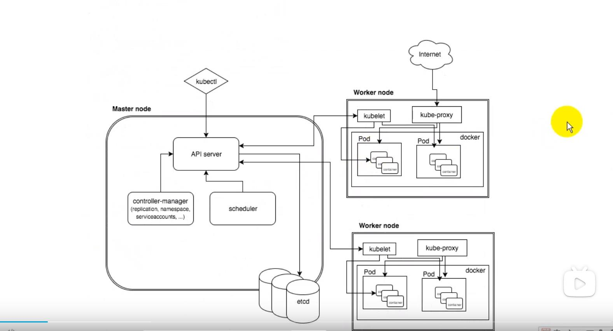
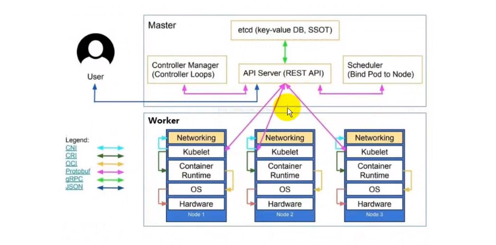

### k8s和docker
一个K8S系统，通常称为一个K8S集群（Cluster）。

这个集群主要包括两个部分：

一个Master节点（主节点）
一群Node节点（计算节点）


一看就明白：Master节点主要还是负责管理和控制。Node节点是工作负载节点，里面是具体的容器。

深入来看这两种节点。

首先是Master节点。


Master节点包括API Server、Scheduler、Controller manager、etcd。

- API Server是整个系统的对外接口，供客户端和其它组件调用，相当于“营业厅”。

- Scheduler负责对集群内部的资源进行调度，相当于“调度室”。

- Controller manager负责管理控制器，相当于“大总管”。

然后是Node节点。


Node节点包括Docker、kubelet、kube-proxy、Fluentd、kube-dns（可选），还有就是Pod。

>>Pod是Kubernetes最基本的操作单元。一个Pod代表着集群中运行的一个进程，它内部封装了一个或多个紧密相关的容器。
>除了Pod之外，K8S还有一个Service的概念，一个Service可以看作一组提供相同服务的Pod的对外访问接口。这段不太好理解，跳过吧。

- Docker，用于创建容器和运行容器。。

- Kubelet，主要负责监视指派到它所在Node上的Pod，包括创建、修改、监控、删除等。

- Kube-proxy，主要负责为Pod对象提供代理。

- Fluentd，主要负责日志收集、存储与查询。

### 额外组件

#### calico
说明：实现k8s内部扁平化网络，功能与flannel类似，效率更高
#### flannel
说明：实现k8s内部扁平化网络，功能与calico类似


## 组件概念
### 概要
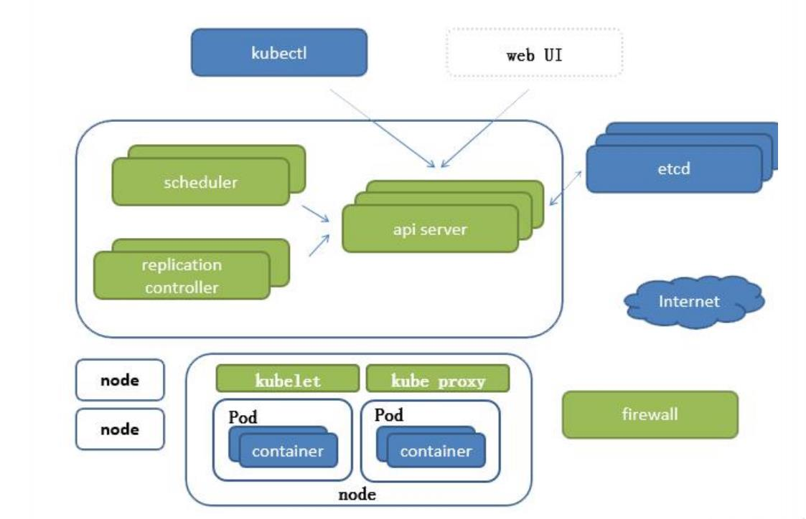
- kube-apiserver用于暴露Kubernetes API。任何的资源请求/调用操作都是通过kube-apiserver提供的接口进行。请参阅构建高可用群集。
- kube-controller-manager运行管理控制器，它们是集群中处理常规任务的后台线程。
- kube-scheduler 监视新创建没有分配到Node的Pod，为Pod选择一个Node。
- ETCD：键值对数据库  储存K8S集群所有重要信息（持久化）
- Kubelet：直接跟容器引擎交互实现容器的生命周期管理
- Kube-proxy：负责写入规则至 IPTABLES、IPVS 实现服务映射访问的
- COREDNS：可以为集群中的SVC创建一个域名IP的对应关系解析
- DASHBOARD：给 K8S 集群提供一个 B/S 结构访问体系
- INGRESS CONTROLLER：官方只能实现四层代理，INGRESS 可以实现七层代理
- FEDERATION：提供一个可以跨集群中心多K8S统一管理功能
- PROMETHEUS：提供K8S集群的监控能力
- ELK：提供 K8S 集群日志统一分析介入平台
- supervisord是一个轻量级的监控系统，用于保障kubelet和docker运行。
- fluentd是一个守护进程，可提供cluster-level logging。

### POD
Pod：Pod是Kubernetes创建或部署的最小/最简单的基本单位，一个Pod代表集群上正在运行的一个进程。
一个Pod封装一个应用容器（也可以有多个容器），存储资源、一个独立的网络IP以及管理控制容器运行方式的策略选项。
Pod代表部署的一个单位：Kubernetes中单个应用的实例，它可能由单个容器或多个容器共享组成的资源

叙述：Pod会启动一个pause的容器，Pod中的其他容器会共用pause容器的网络和存储卷；即Pod中的容器端口需要独立，不能相同
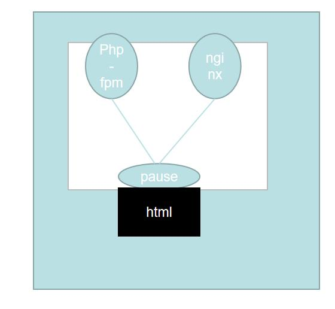

分类（非官方）
- 自主式Pod：没有统一管理，死亡后无法自主重启
- 控制器管理的Pod


### 服务发现

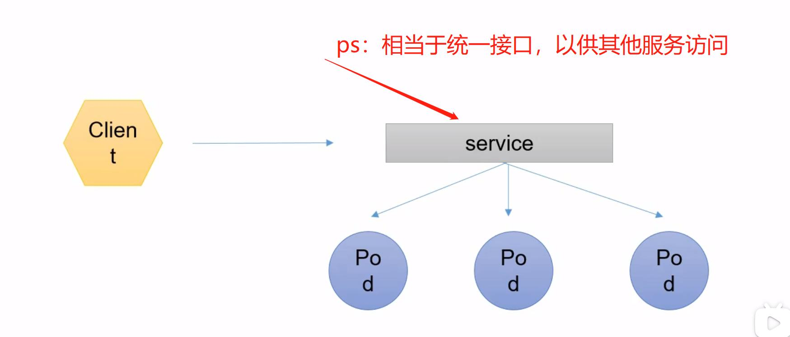
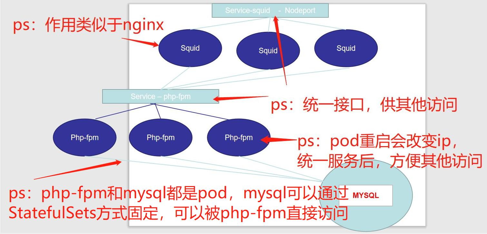

### 网络通讯方式
参考：<https://www.bilibili.com/video/BV1w4411y7Go?p=9>
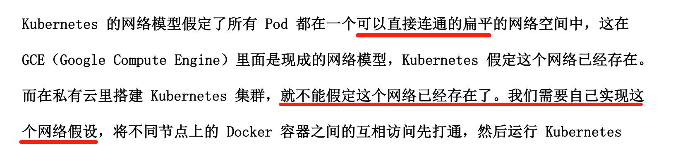
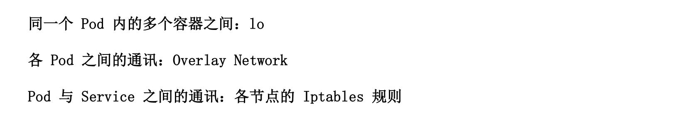
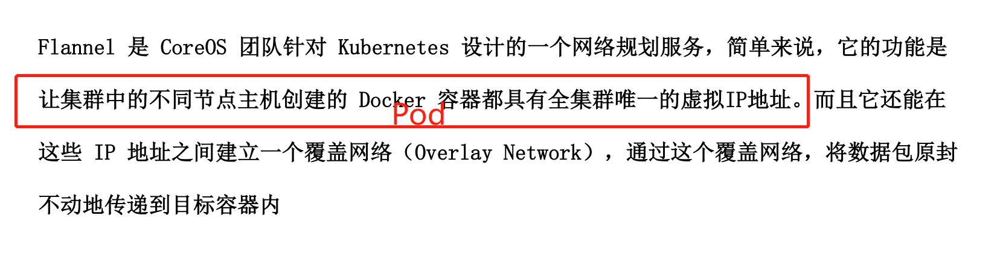
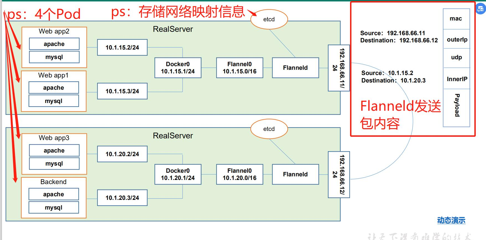


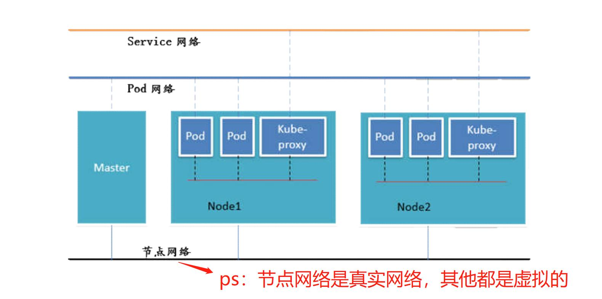

## 额外知识

### harbor
说明：私有库

## 安装

### virtualbox安装
参考：<https://blog.csdn.net/u010411264/article/details/104571071/>
参考：<https://www.cnblogs.com/hihtml5/p/8217062.html>
备注：复制虚拟机，选择`为所有网卡重新生成MAC地址`，其他选项默认即可；然后在`副本虚拟机`处于关机状态时，更新其MAC地址，如下图，
    然后重启，其ip地址就可以被更改


### kubeadm安装
参考【已下载】：<https://www.cnblogs.com/zhizihuakai/p/12629514.html>


### sealos安装
参考：<https://github.com/fanux/sealos>

### rancher
官网：<https://docs.rancher.cn/docs/rancher2/overview/_index>

## 资源类型
说明：类似于docker的docker-compose.yaml文件，即配置文件；
     k8s中所有内容都抽象为资源，资源实例化后，叫做对象

### 资源类型
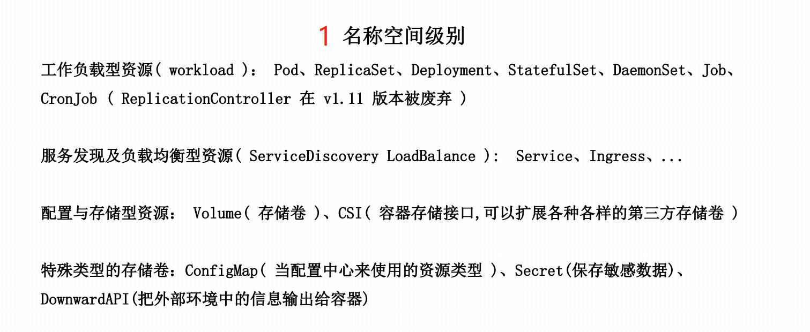
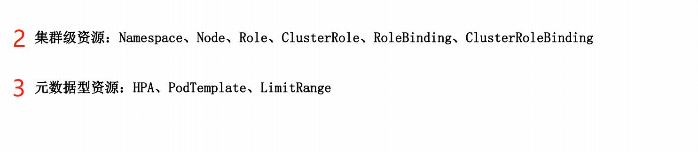

### YAML格式
参考：<https://www.runoob.com/w3cnote/yaml-intro.html>

### 资源清单
说明：在 K8S 中，一般使用 yaml 格式的文件来创建符合我们预期期望的 pod，这样的 yaml 文件我们一般称为资源清单。

#### 常用字段的解释
必须存在的属性
```
参数名	字段类型	说明
version	String	K8S API 的版本，目前基本是v1，可以用 kubectl api-version 命令查询
kind	String	这里指的是 yaml 文件定义的资源类型和角色, 比如: Pod
metadata	Object	元数据对象，固定值写 metadata
metadata.name	String	元数据对象的名字，这里由我们编写，比如命名Pod的名字
metadata.namespace	String	元数据对象的命名空间，由我们自身定义
Spec	Object	详细定义对象，固定值写Spec
spec.containers[]	list	这里是Spec对象的容器列表定义，是个列表
spec.containers[].name	String	这里定义容器的名字
spec.containers[].image	String	这里定义要用到的镜像名称
```

#### 主要对象
```
spec.containers[].name            (String): 定义容器的名字
spec.containers[].image           (String): 走义要用到的镜虑名称
spec.containers[].imagePullPolicy (String): 定义镜像拉取策，有Always、Never、IfNotPresent 三个值可选
                                         (1)Always:是每次都尝试重新拉取镜像
                                         (2)Never:表示仅便用本地镜 
                                         (3)IfNOtPresent：如果本地有镜像就使用本地镜像，没有就拉取在线镜像。
                                         默认值是Always。
spec.containers[].command[]    (List): 指定容器启动命令，因为是数组可以指定多个，不指定则使用镜像打包时使用的启动命令。
spec.containers[].args[]      (List): 指定容器启动命令参数，因为是数组可以指定多个。
spec.containers[].worKingDir (String): 指定容器工作目录

spec.containers[].volumeMounts[]             (List): 指容器内部的存卷配置
spec.containers[].volumeMounts[].name      (String): 指可以被容器挂载的存储卷的名称
spec.containers[].volumeMounts[].mountPatn (String): 指可以被容器挂载的存储卷路径
spec.containers[].volumeMounts[].readOnly  (String): 设置存储卷路径的读写模式，ture或者false,默认为读写模式

spec.containers[].ports[]                 (List): 指走容器需要用到的端囗列表
spec.containers[].ports[].name          (String): 指定端口名称
spec.containers[].ports[].containerPort (String): 指定容器需要监听的端囗号
spec.containers[].ports[].hostPort      (String): 指定容器所在主机需要监听的端囗号，默认跟上面containerPort相同，注意设置了
                                          hostPort同一台主机无法启动该容器的相同副本（因为主机端囗号不能相同，这样会冲突）
spec.containers[].ports[].protocol      (String):指定端囗协议，支持TCP和UDP,默认值为TCP

spec.containers[].env[]          (List): 指定容器运行前需设置的环境变量列表
spec.containers[].env[].name   (String): 指定环境变量名称
spec.containers[].env[].value  (String): 指定环境变量值

spec.containers[].resources               (Object): 指定资源限制和资源请求的值（这里开始就是设置容器的资源上限〕
spec.containers[].resources.limits        (Object): 指定设置容器运行时资源的运行上限
spec.containers[].resources.limits.cpu    (String): 指定CPU的限制，单位为core数，将用于 docker run --cpu-shares参数（这里
                                                 前面文章Pod资源限制有讲过）
spec.containers[].resources.limits.memory (String): 指定MEM内存的限制，单位为MiB、GiB

spec.restartPolicy    (String): 定义Pod的重启策略，可选值为Always、OnFailure, 默认值为 Always。
                           1.Always: Pod 一旦终止运行，则无论容器是如何终止的，Kubelet服务都将重启它。
                           2.OnFailure:只有Pod以非零退出码终止时，kubelet才会重启该容器。如果容器正常结束〔退出码为0），则
                             kubelet将不会重启它。
                           3.Never:Pod终止后，kubelet将退出码报给Master,不会重该Pod。
spec.nodeSelector     (Object): 定义Node的Label过滤标签,以key:value格式指定
spec.imagePuIlSecrets (Object): 定义pull镜像时便用secret名称，以name:secretkey格式指定
spec.hostNetwork     (Boolean): 定义是否使用主机网络模式，默认值为false。设置true表示使用宿主机网络，不使用docker网桥，同时设置了
                             true将无法在同一台宿主机上启动第二个副本。
```


#### 资源清单示例文件
pod.yaml
```yaml
apiVersion: v1
kind: Pod   # Pod首字母大写
metadata:
  name: myapp-pod # 缩进必须是空格，不能为tab
  labels:
    app: myapp
spec:
  containers:
  - name: appcalico
    image: registry.cn-hangzhou.aliyuncs.com/neo1303582949/test:v0.1
    
```

### 容器生命周期
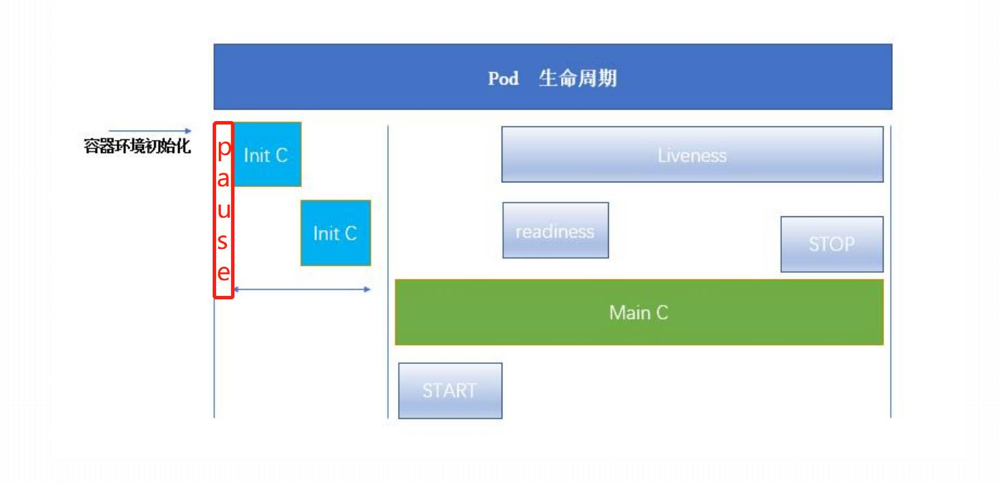

### init C
说明：挨个串行化启动，第一个init c启动，然后退出后，再启动第二个init c
声明
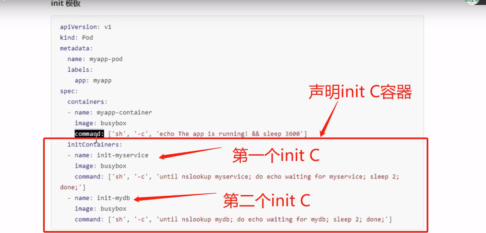

### service(svc)模板
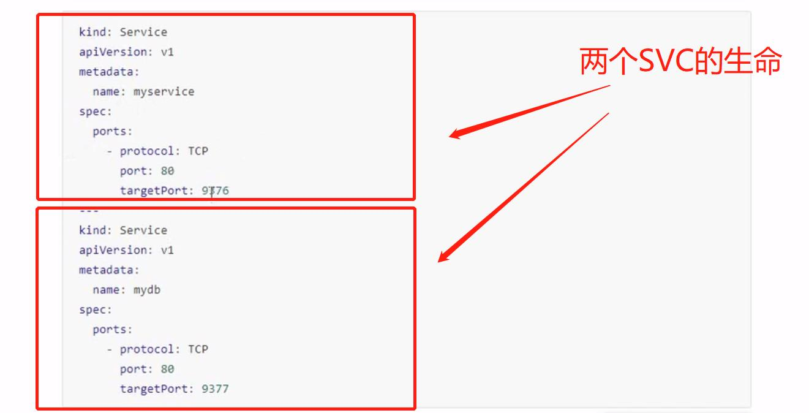

### 探针
说明：对线上业务来说，保证服务的正常稳定是重中之重，对故障服务的及时处理避免影响业务以及快速恢复一直是开发运维的难点。
Kubernetes提供了健康检查服务，对于检测到故障服务会被及时自动下线，以及通过重启服务的方式使服务自动恢复。

#### Liveness探针
**主要用于判断Container是否处于运行状态**，比如当服务crash或者死锁等情况发生时，kubelet会kill掉Container，
然后根据其设置的restart policy进行相应操作（可能会在本机重新启动Container，或者因为设置Kubernetes QoS，
本机没有资源情况下会被分发的其他机器上重新启动）。

#### Readness探针
**主要用于判断服务是否已经正常工作**，如果服务没有加载完成或工作异常，服务所在的Pod的IP地址会从服务的Endpoints中被移除，
也就是说，当服务没有ready时，会将其从服务的load balancer中移除，不会再接受或响应任何请求。


k8s支持存活livenessProbe和就绪readinessProbe两种探针，两种探针都支持以下三种方式

一、exec
通过执行shell命令的方式，判断退出状态码是否是0
示例
    
    exec:
    command:
    - cat
    - /tmp/healthy
二、tcp
通过TCP请求的方式，是否能建立tcp连接
示例

    tcpSocket:
    port: 8080
    initialDelaySeconds: 15
    periodSeconds: 20

三、httpGet
通过发起http请求，判断返回结果是否符合预期

    ...
    livenessProbe:
         httpGet:
           path: /healthz
           port: 8080
           httpHeaders:
           - name: X-Custom-Header
             value: Awesome
           initialDelaySeconds: 3
           periodSeconds: 3
           
ps：initialDelaySeconds指定了容器启动后多少秒后进行探测
ps：periodSeconds指定每隔多少秒进行探测

探针检查结果分为3种情况：

成功（Success）：通过检查。
失败（Failure）：检查失败。
未知（Unknown）：检查未知，需要人工干预。

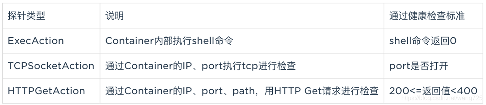

服务可用性与自动恢复

- 如果服务的健康检查（readiness）失败，故障的服务实例从service endpoint中下线，外部请求将不会再转发到该服务上，
  一定程度上保证正在提供的服务的正确性，如果服务自我恢复了（比如网络问题），会自动重新加入service endpoint对外提供服务。
- 另外，如果设置了Container（liveness）的探针，对故障服务的Container（liveness）的探针同样会失败，container会被kill掉，
  并根据原设置的container重启策略，系统倾向于在其原所在的机器上重启该container、或其他机器重新创建一个pod。

#### 使用建议
- 对全部服务同时设置服务（readiness）和Container（liveness）的健康检查。
- 通过TCP对端口检查（TCPSocketAction），仅适用于端口已关闭或进程停止情况。因为即使服务异常，只要端口是打开状态，健康检查仍然是通过的。
- 基于第二点，一般建议用ExecAction自定义健康检查逻辑，或采用HTTP Get请求进行检查（HTTPGetAction）。
- 无论采用哪种类型的探针，一般建议设置检查服务（readiness）的时间短于检查Container（liveness）的时间，
  也可以将检查服务（readiness）的探针与Container（liveness）的探针设置为一致。目的是故障服务先下线，
  如果过一段时间还无法自动恢复，那么根据重启策略，重启该Container、或其他机器重新创建一个Pod恢复故障服务。

Pod的重启策略：

当pod中一个container处于退出状态(Exited)时，kubelet会根据Pod Spec中设置restartPolicy进行相应操作，重启的策略分别如下：

- Always: 默认的重启策略，只要有一个container处于Exited时，即会重启
- OnFailure：container退出状态不为0时，即会重启。
- Never: 从不重启。

需要重点说明的是：
一个pod设置重启策略，适用于pod中全部container。
处于退出状态的容器由 kubelet 以五分钟为上限的指数衰减延迟（10秒，20秒，40秒…）重新启动，并在container重启成功十分钟后会重置该值。

#### 探针示例

liveness.yaml
说明：容器会创建一个文件/tmp/healthy,30秒后删除；探针5秒会检查一次，检查方式为cat /tmp/healthy文件是否存在，
     检查到容易有问题，探测失败3次，则重建容器；ps：这里只是测试功能，真实情况时，并不会删除/tmp/healthy，毕竟一般不需要重启
```yaml
apiVersion: v1
kind: Pod
metadata:
  labels:
    test: liveness
  name: liveness-exec-wfq
spec:
  containers:
  - name: liveness
    image: registry.cn-hangzhou.aliyuncs.com/neo1303582949/test:v0.1
    imagePullPolicy: IfNotPresent
    command:
    - "/bin/sh"
    - "-c"
    - "touch /tmp/healthy; sleep 15; rm -rf /tmp/healthy; sleep 600"
    livenessProbe:
      exec:
        command:
        - "/bin/sh"
        - "-c"
        - "cat /tmp/healthy"
      initialDelaySeconds: 5
      periodSeconds: 5
```
说明：检查结果不成功，容器关闭，Pod重启

liveness_http.yaml
```yaml
apiVersion: v1
kind: Pod
metadata:
  labels:
    test: liveness
  name: liveness-http-wfq
spec:
  containers:
  - name: liveness
    image: googlecontainer/liveness
    args:
    - /server
    livenessProbe:
      httpGet:
        path: /healthz
        port: 8080
        httpHeaders:
        - name: X-Custom-Header
          value: Awesome
      initialDelaySeconds: 3
      periodSeconds: 3
```

readness.yaml
```yaml
apiVersion: v1
kind: Service
metadata:
  name: nginxsvc
  labels:
    app: nginx
spec:
  type: NodePort
  ports:
  - port: 80
    protocol: TCP
    name: http
  - port: 443
    protocol: TCP
    name: https
  selector:
    run: my-nginx
---
apiVersion: apps/v1
kind: Deployment
metadata:
  name: my-nginx
spec:
  selector:
    matchLabels:
      run: my-nginx
  replicas: 2
  strategy:
    rollingUpdate:
      maxSurge: 0
      maxUnavailable: 1
  template:
    metadata:
      labels:
        run: my-nginx
    spec:
      containers:
      - name: nginxhttps
        image: ymqytw/nginxhttps:1.5
        command: ["/home/auto-reload-nginx.sh"]
        ports:
        - containerPort: 443
        - containerPort: 80
        livenessProbe:
          httpGet:
            path: /index.html
            port: 80
          initialDelaySeconds: 30
          periodSeconds: 10
          successThreshold: 1
          failureThreshold: 3
          timeoutSeconds: 1
        readinessProbe:
          httpGet:
            path: /index.html
            port: 80
          initialDelaySeconds: 30
          periodSeconds: 10
          successThreshold: 1
          failureThreshold: 3
          timeoutSeconds: 1

```

initcontailner
如在initcontainer中先拉取nginx的配置，然后在nginx container 中去消费nginx的配置

init_container.yaml
```yaml
apiVersion: v1
kind: Pod
metadata:
  name: myapp-pod
  labels:
    app: myapp
spec:
  containers:
  - name: myapp-container
    image: busybox
    command: ['sh', '-c', 'echo The app is running! && sleep 3600']
  initContainers:
  - name: init-myservice
    image: busybox
    command: ['sh', '-c', 'until nslookup myservice; do echo waiting for myservice; sleep 2; done;']
  - name: init-mydb
    image: busybox
    command: ['sh', '-c', 'until nslookup mydb; do echo waiting for mydb; sleep 2; done;’]
```

### start、stop、相位
说明：start、stop为主容器main c启动和退出时的钩子
```yaml
apiVersion: v1
kind: Pod
metadata:
 name: lifecycle-demo
spec:
 containers:
 - name: lifecycle-demo-container
   image: nginx
 lifecycle:
  postStart:
   exec:
    command: ["/bin/sh", "-c", "echo Hello from the postStart handler >
/usr/share/message"]
  preStop:
   exec:
    command: ["/bin/sh", "-c", "echo Hello from the poststop handler >
/usr/share/message"]
```

## 命名空间
说明：Kubernetes 支持多个虚拟集群，它们底层依赖于同一个物理集群。 这些虚拟集群被称为命名空间。
### 查看命名空间
```shell script
[root@master-11 ~]# kubectl get ns
NAME              STATUS   AGE
default           Active   43h
kube-public       Active   43h
kube-system       Active   43h
```
Kubernetes 会创建三个初始命名空间：

- default     没有指明使用其它命名空间的对象所使用的默认命名空间
- kube-system Kubernetes    系统创建对象所使用的命名空间
- kube-public 这个命名空间是自动创建的，所有用户（包括未经过身份验证的用户）都可以读取它。
              这个命名空间主要用于集群使用，以防某些资源在整个集群中应该是可见和可读的。
              这个命名空间的公共方面只是一种约定，而不是要求。


### 并非所有对象都在命名空间中
**大多数 kubernetes 资源（例如 Pod、Service、副本控制器等）都位于某些命名空间中。
但是命名空间资源本身并不在命名空间中。而且底层资源，例如 nodes和持久化卷不属于任何命名空间。**

可以使用下面命令查看哪些 Kubernetes 资源在命名空间中，哪些不在命名空间中：
```shell script
kubectl api-resources --namespaced=true   ##查看哪些资源在命令空间
kubectl api-resources --namespaced=false  ##查看哪些资源不在命令空间
# 可以在查看资源的时候加上指定的命名空间
kubectl get pods -n kube-system ##查看kube-system命令空间的pod
# 创建命名空间
kubectl create ns test ##创建一个叫test的命名空间
# 切换命令空间
kubectl  config set-context --current --namespace=kube-system  ##切换至kube-system的命名空间
```


## 控制器

### 控制器说明
声明式编程：幂等，多次执行结果一致；如mysql的sql语句；控制器Deployment为声明式
          语法：apply 

命令式编程：一条一条语句执行；如：控制器RS
          语法：create

ps：无论声明式和命令式都可以用apply或create，只不过上面说的是最优

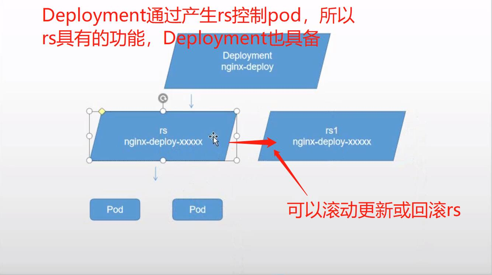

### 控制器类型

#### ReplicationController（不用了） && ReplicaSet
ReplicationController（RC）用来确保容器应用的副本数始终保持在用户定义的副本数，
即如果有容器异常退 出，会自动创建新的 Pod 来替代；而如果异常多出来的容器也会自动回收；

在新版本的 Kubernetes 中建议使用 ReplicaSet 来取代 ReplicationController 。

ReplicaSet 跟 ReplicationController 没有本质的不同，只是名字不一样，并且 ReplicaSet 支持集合式的 selector；

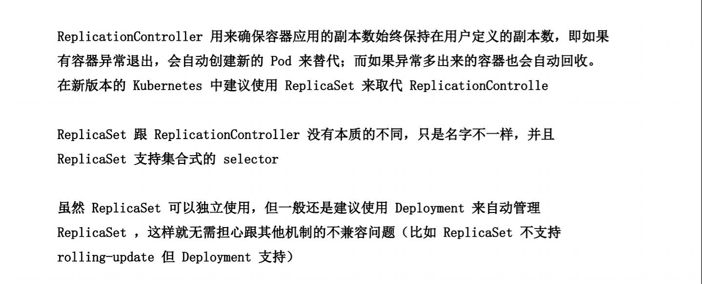
备注：截图为视频教程中说明，尽量以文档为准   

##### RS的声明文件
rs.yaml
```yaml
apiVersion: extensions/v1beta1
kind: ReplicaSet
metadata: 
  name: frontend
spec:
  replicas: 3
  selector:
  # rs控制器通过matchLabels得到需要控制的Pod标签，来控制对应名称的Pod
  # 一开始Pod由该控制器创建，但后来改变了标签，那么控制器不认这个Pod
    matchLabels:
      tier: frontend
  # template后其实就是以前的pod声明文件
  template:
    metadata:
      labels:
        tier: frontend
    spec:
      containers:
      - name: rs-nginx
        image: registry.cn-hangzhou.aliyuncs.com/neo1303582949/test:v0.1
        env:
        - name: GET_HOSTS_FROM
          value: dns
        ports:
        - containerPort: 80
```
- 执行命令：`kubectl create -f rs.yaml --record`；ps：`--record`参数可以记录命令，可以方便查看`revision`变化，在`kubectl rollout history`查看
- 查看命令：`kubectl get pod --show-labels`
- 删除命令：`kubectl delete pod --all`;删除默认命名空间下所有Pod，只有控制器管理的Pod会重启
- 删除控制器：`kubectl delete rs frontend`或删除全部`kubectl delete rs --all`；ps：控制器删除后，对应Pod自动被删除


#### Deployment
ps：建议采用 
Deployment 为 Pod 和 ReplicaSet 提供了一个声明式定义 (declarative) 方法，
用来替代以前的 ReplicationController 来方便的管理应用。典型的应用场景包括；

- 定义 Deployment 来创建 Pod 和 ReplicaSet
- 滚动升级和回滚应用
- 扩容和缩容
- 暂停和继续 Deployment


推荐采用：Deployment --创建--> ReplicaSet --创建--> Pod

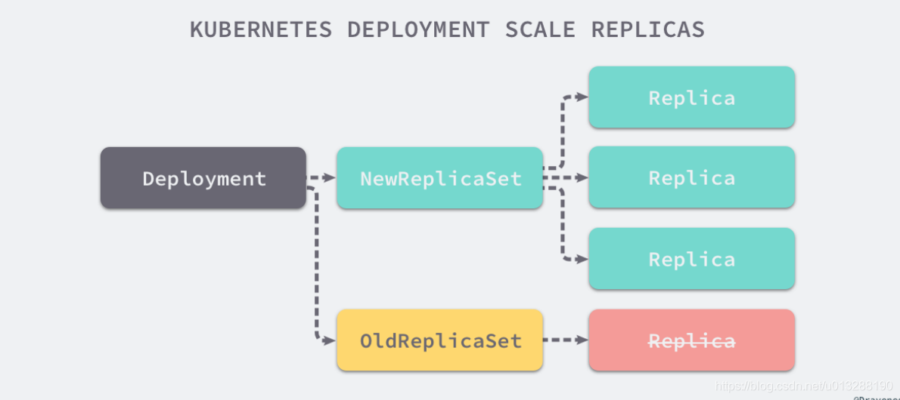

##### Deployment的声明文件
```yaml
apiVersion: extensions/v1beta1
kind: Deployment
metadata:
  name: nginx-deployment
spec:
  replicas: 3
  template:
    metadata:
      labels:
        app: nginx
    spec:
      containers:
      - name: de-nginx
        image: registry.cn-hangzhou.aliyuncs.com/neo1303582949/test:v0.1
        ports:
        - containerPort: 80
```
说明：
`kubectl create -f https://kubernetes.io/docs/user-guide/nginx-deployment.yaml --record`
`       --record`参数可以记录命令，我们可以很方便的查看每次 revision 的变化

##### 扩容
`kubectl scale deployment nginx-deployment --replicas 10`;ps：扩充副本为10份
ps：`nginx-deployment`来自`metadata.name`的值


##### 利用HPA自动扩展
说明：如果集群支持 horizontal pod autoscaling 的话，还可以为Deployment设置自动扩展
`kubectl autoscale deployment nginx-deployment --min=10 --max=15 --cpu-percent=80`

##### 更新镜像
`kubectl set image deployment/nginx-deployment nginx=nginx:1.9.1`
说明：更新一般采用25%-25%，即更新依次更新25%数量的Pod，当然这个可以更改的
ps：`nginx-deployment`来自`metadata.name`的值
ps：`nginx=...`左边`nginx`来自`spec.template.metadata.spec.containers.name`的值


##### 更新 Deployment
假如我们现在想要让 nginx pod 使用 nginx:1.9.1 的镜像来代替原来的 nginx:1.7.9 的镜像
```
$ kubectl set image deployment/nginx-deployment nginx=nginx:1.9.1
deployment "nginx-deployment" image updated
```
    
可以使用 edit 命令来编辑 Deployment
```
$ kubectl edit deployment/nginx-deployment
deployment "nginx-deployment" edited
```

查看 rollout 的状态
```
$ kubectl rollout status deployment/nginx-deployment
Waiting for rollout to finish: 2 out of 3 new replicas have been updated...
deployment "nginx-deployment" successfully rolled out
```

查看历史 RS
```
$ kubectl get rs
NAME DESIRED CURRENT READY AGE
nginx-deployment-1564180365 3 3 0 6s
nginx-deployment-2035384211 0 0 0 36s
```

##### Deployment 更新策略
Deployment 可以保证在升级时只有一定数量的 Pod 是 down 的。默认的，它会确保至少有比期望的Pod数量少 一个是up状态（最多一个不可用）

Deployment 同时也可以确保只创建出超过期望数量的一定数量的 Pod。默认的，它会确保最多比期望的Pod数 量多一个的 Pod 是 up 的（最多1个 surge ）

未来的 Kuberentes 版本中，将从1-1变成25%-25%
```
kubectl describe deployments
```
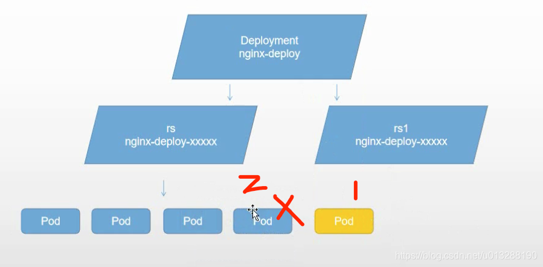
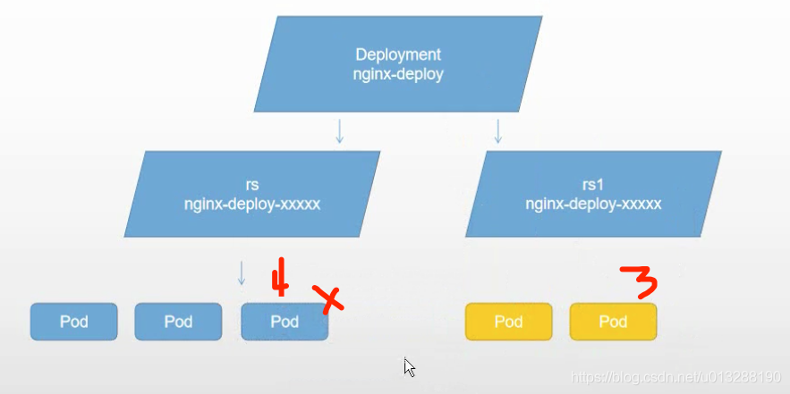


##### Rollover（多个rollout并行）
假如您创建了一个有5个 niginx:1.7.9  replica的 Deployment，
但是当还只有3个 nginx:1.7.9 的 replica 创建 出来的时候您就开始更新含有5个 nginx:1.9.1  
replica 的 Deployment。在这种情况下，Deployment 会立即 杀掉已创建的3个 nginx:1.7.9 的 Pod，
并开始创建 nginx:1.9.1 的 Pod。它不会等到所有的5个 nginx:1.7.9 的 Pod 都创建完成后才开始改变航道

##### 回滚 Deployment
说明：回滚是简单回滚一次，如：3回滚到2，如果再次回滚，那么再次回到3
命令：`kubectl rollout undo deployment/nginx-deployment`
```
kubectl set image deployment/nginx-deployment nginx=nginx:1.91
kubectl rollout status deployments nginx-deployment
kubectl get pods
kubectl rollout history deployment/nginx-deployment  # 显示版本号
kubectl rollout undo deployment/nginx-deployment
kubectl rollout undo deployment/nginx-deployment --to-revision=2 ## 可以使用 --revision参数指定
某个历史版本
kubectl rollout pause deployment/nginx-deployment ## 暂停 deployment 的更新
```

备注：您可以用 `kubectl rollout status [controller-type] [controller-name]` 命令查看 Deployment 是否完成。如果 rollout 成功完成， 
     `kubectl rollout status` 将返回一个0值的 Exit Code
   
##### 清理 Policy
您可以通过设置 .spec.revisonHistoryLimit 项来指定 deployment 最多保留多少 revision 历史记录。
默认的会 保留所有的 revision；如果将该项设置为0，Deployment 就不允许回退了

参考：<https://blog.csdn.net/u013288190/article/details/110191261>


#### Horizontal Pod Autoscaling(HPA)
概念：应用的资源使用率通常都有高峰和低谷的时候，如何削峰填谷，提高集群的整体资源利用率，让service中的Pod 个数自动调整呢？
这就有赖于Horizontal Pod Autoscaling了，顾名思义，使Pod水平自动缩放
并且HPA以其他的控制器类型为基础，实现的扩展
    
#### StatefulSets
- StatefulSet 作为 Controller 为 Pod 提供唯一的标识。它可以保证部署和 scale 的顺序
- StatefulSet是为了解决有状态服务的问题（对应Deployments和ReplicaSets是为无状态服务而设计），其应用 场景包括：
- 稳定的持久化存储，即Pod重新调度后还是能访问到相同的持久化数据，基于PVC来实现
- 稳定的网络标志，即Pod重新调度后其PodName和HostName不变，基于Headless Service（即没有 Cluster IP的Service）来实现
- 有序部署，有序扩展，即Pod是有顺序的，在部署或者扩展的时候要依据定义的顺序依次依次进行（即从0到 N-1，在下一个Pod运行之前所有之前的Pod必须都是Running和Ready状态），基于init containers来实 现
- 有序收缩，有序删除（即从N-1到0）


#### DeamonSet
DaemonSet 确保全部（或者一些）Node 上运行一个 Pod 的副本。当有 Node 加入集群时，也会为他们新增一个 Pod 。当有 Node 从集群移除时，
这些 Pod 也会被回收。删除 DaemonSet 将会删除它创建的所有 Pod

使用 DaemonSet 的一些典型用法：

- 运行集群存储 daemon，例如在每个 Node 上运行 glusterd 、 ceph
- 在每个 Node 上运行日志收集 daemon，例如 fluentd 、 logstash
- 在每个 Node 上运行监控 daemon，例如 Prometheus Node Exporter、 collectd 、Datadog 代理、 New Relic 代理，或 Ganglia gmond

##### DeamonSet的声明文件
```yaml

apiVersion: apps/v1
kind: DaemonSet
metadata:
  name: deamonset-example
  labels:
    app: daemonset
spec:
  selector:
    matchLabels:
      name: deamonset-example
  template:
    metadata:
      labels:
        name: deamonset-example
    spec:
      containers:
        - name: daemonset-example
        image: wangyanglinux/myapp:v1
```


#### Job  
Job 负责批处理任务，即仅执行一次的任务，它保证批处理任务的一个或多个 Pod 成功结束；
ps：猜测意思是将任务重复执行多少次，都成功才结束;完成后容器就退出;

K8S支持以下几种方式:

- 非并行Job:
    + 通常只运行一个Pod，Pod成功结束Job就退出。
- 固定完成次数的并行Job:
    + 并发运行指定数量的Pod，直到指定数量的Pod成功，Job结束。
- 带有工作队列的并行Job:
    + 用户可以指定并行的Pod数量，当任何Pod成功结束后，不会再创建新的Pod
    + 一旦有一个Pod成功结束，并且所有的Pods都结束了，该Job就成功结束。
    + 一旦有一个Pod成功结束，其他Pods都会准备退出。


特殊说明

- 单个Pod时，默认Pod成功运行后Job即结束
- RestartPolicy仅支持Never或OnFailure
- .spec.template格式同Pod
- .spec.completions 标志Job结束需要成功运行的Pod个数，默认为1
- .spec.parallelism 指定job在任一时刻应该并发运行Pods的数量。默认值: 1
- .spec.activeDeadlineSeconds 标志失败Pod的重试最大时间，超过这个时间不会继续重试
- .spec.backoffLimit: 指定job失败后进行重试的次数。默认是6次，每次失败后重试会有延迟时间，该时间是指数级增长，最长时间是6min。

##### Job声明文件
```yaml
apiVersion: batch/v1
kind: Job
metadata:
  name: pi
spec:
  template:
    metadata:
      name: pi
    spec:
      containers:
      - name: pi
        image: perl
        command: ["perl", "-Mbignum=bpi", "-wle", "print bpi(2000)"]
      restartPolicy: Never
```
查看命令：`kubectl get jobs`


#### Cron Job
Cron Job 管理基于时间的 Job，即：

- 在给定时间点只运行一次
- 周期性地在给定时间点运行
>>使用前提条件：**当前使用的 Kubernetes 集群，版本 >= 1.8（对 CronJob）。
>对于先前版本的集群，版本 < 1.8，启动 API Server时，
>通过传递选项 --runtime-config=batch/v2alpha1=true 
>可以开启 batch/v2alpha1 API**

典型的用法如下所示：

- 在给定的时间点调度 Job 运行
- 创建周期性运行的 Job，例如：数据库备份、发送邮件

##### CronJob Spec
- .spec.schedule ：调度，必需字段，指定任务运行周期，格式同 Cron
- .spec.jobTemplate ：Job 模板，必需字段，指定需要运行的任务，格式同 Job
- .spec.startingDeadlineSeconds ：启动 Job 的期限（秒级别），该字段是可选的。如果因为任何原因而错 过了被调度的时间，那么错过执行时间的 Job 将被认为是失败的。如果没有指定，则没有期限
- .spec.concurrencyPolicy ：并发策略，该字段也是可选的。它指定了如何处理被 Cron Job 创建的 Job 的 并发执行。只允许指定下面策略中的一种： Allow （默认）：允许并发运行 Job ；Forbid ：禁止并发运行，如果前一个还没有完成，则直接跳过下一个 ；Replace ：取消当前正在运行的 Job，用一个新的来替换 注意，当前策略只能应用于同一个 Cron Job 创建的 Job。如果存在多个 Cron Job，它们创建的 Job 之间总 是允许并发运行。
- .spec.suspend ：挂起，该字段也是可选的。如果设置为 true ，后续所有执行都会被挂起。它对已经开始 执行的 Job 不起作用。默认值为 false 。
- .spec.successfulJobsHistoryLimit 和 .spec.failedJobsHistoryLimit ：历史限制，是可选的字段。它 们指定了可以保留多少完成和失败的 Job。默认情况下，它们分别设置为 3 和 1 。设置限制的值为 0 ，相 关类型的 Job 完成后将不会被保留。

##### CronJob声明文件
```yaml
apiVersion: batch/v1beta1
kind: CronJob
metadata:
  name: hello
spec:
  schedule: "*/1 * * * *"
  jobTemplate:
    spec:
      template:
        spec:
          containers:
          - name: hello
            image: registry.cn-hangzhou.aliyuncs.com/neo1303582949/test:v0.1
            command:
            - "/bin/sh"
            - "-c"
            - "date; echo Hello from the Kubernetes cluster"
          restartPolicy: OnFailure
```
查看CronJob命令：`kubectl get cronjob`
注意，删除 cronjob 的时候不会自动删除 job，这些 job 可以用 `kubectl delete job` 来删除

##### CronJob 本身的一些限制
创建 Job 操作应该是 幂等的

## service(svc)

### service概念
Kubernetes  Service 定义了这样一种抽象：一个 Pod 的逻辑分组，一种可以访问它们的策略 —— 通常称为微 服务。 
这一组 Pod 能够被 Service 访问到，通常是通过 Label Selector

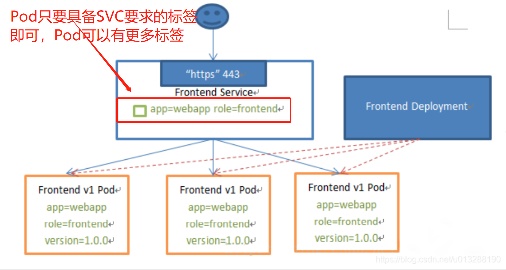
Service能够提供负载均衡的能力，但是在使用上有以下限制： 
只提供 4 层负载均衡能力，而没有 7 层功能，但有时我们可能需要更多的匹配规则来转发请求，这点上 4 层 负载均衡是不支持的
可以通过ingress来实现


### service的组成
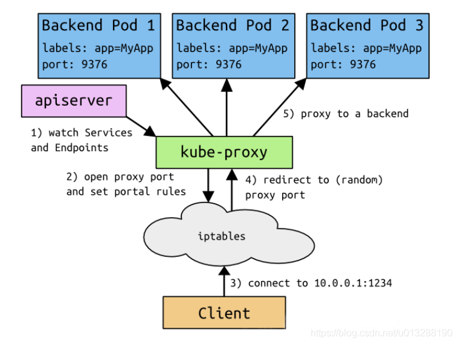

### Service 的类型
Service 在 K8s 中有以下四种类型

#### 1. ClusterIp
默认类型，自动分配一个仅 Cluster 内部可以访问的虚拟 IP
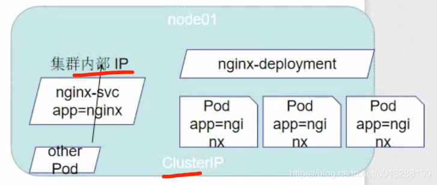

clusterIP 主要在每个 node 节点使用 iptables，将发向 clusterIP 对应端口的数据，转发到 kube-proxy 中。
然 后 kube-proxy 自己内部实现有负载均衡的方法，并可以查询到这个 service 下对应 pod 的地址和端口，
进而把 数据转发给对应的 pod 的地址和端口

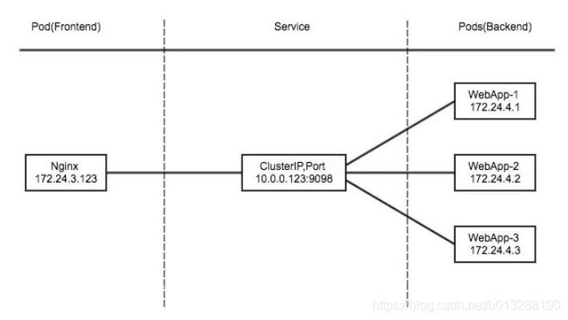

为了实现图上的功能，主要需要以下几个组件的协同工作：

- apiserver 用户通过kubectl命令向apiserver发送创建service的命令，apiserver接收到请求后将数据存储 到etcd中
- kube-proxy kubernetes的每个节点中都有一个叫做kube-porxy的进程，这个进程负责感知service，pod 的变化，并将变化的信息写入本地的iptables规则中
- iptables 使用NAT等技术将virtualIP的流量转至endpoint中

创建 myapp-deploy.yaml 文件
```yaml
apiVersion: apps/v1
kind: Deployment
metadata:
  name: myapp-deploy
  namespace: default
spec:
  replicas: 3
  selector:
    matchLabels:
      app: myapp
      release: stabel
  template:
    metadata:
      labels:
        app: myapp
        release: stabel
        env: test
    spec:
      containers:
      - name: myapp
        image: registry.cn-hangzhou.aliyuncs.com/neo1303582949/test:v0.1
        imagePullPolicy: IfNotPresent
        ports:
        - name: http
          containerPort: 80
```
创建 Service 信息

`vim myapp-service.yaml`
```yaml
apiVersion: v1
kind: Service
metadata:
  name: myapp
  namespace: default
spec:
  type: ClusterIP
  selector:
    app: myapp
    release: stabel
  ports:
  - name: http
    port: 80
    targetPort: 80
```
说明：可以通过访问ClusterIp-SVC产生的内部ip，访问服务

#### Headless Service（特殊的Cluster IP）
有时不需要或不想要负载均衡，以及单独的 Service IP 。
遇到这种情况，可以通过指定 Cluster IP(spec.clusterIP) 的值为 “None” 来创建 Headless Service 。
这类 Service 并不会分配 Cluster IP， kubeproxy 不会处理它们，而且平台也不会为它们进行负载均衡和路由

ps：访问Headless Service（无头服务），依然会返回关联（通过spec.selector标签关联）的全部Pods IP地址
，主要用于开发者自己根据pods进行负载均衡器的开发(设置了selector)。

myapp-svc-headless.yaml
```yaml
apiVersion: v1
kind: Service
metadata:
 name: myapp-headless
 namespace: default
spec:
 selector:
  app: myapp
 clusterIP: "None"
 ports:
 - port: 80
   targetPort: 80
```
验证
`dig -t A myapp-headless.default.svc.cluster.local. @10.244.0.14`; @10.244.0.14为coredns所在IP


#### NodePort：
在 ClusterIP 基础上为 Service 在每台机器上绑定一个端口，这样就可以通过 : NodePort 来访 问该服务

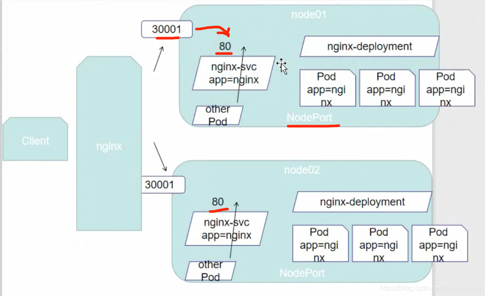
nodePort 的原理在于在 node 上开了一个端口，将向该端口的流量导入到 kube-proxy，
然后由 kube-proxy 进 一步到给对应的 pod

myapp-service.yaml
```yaml

apiVersion: v1
kind: Service
metadata:
  name: myapp
  namespace: default
spec:
  type: NodePort
  selector:
    app: myapp
    release: stabel
  ports:
  - name: http
    port: 80
    targetPort: 80
```
查询流程
```yaml
iptables -t nat -nvL
KUBE-NODEPORTS
```
备注：一组pod可以对应多个service

#### LoadBalancer
在 NodePort 的基础上，借助 cloud provider 创建一个外部负载均衡器，并将请求转发 到: NodePort

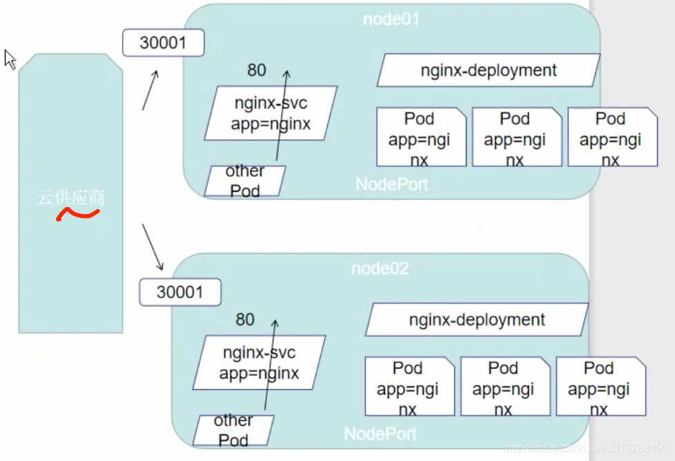
loadBalancer 和 nodePort 其实是同一种方式。
区别在于 loadBalancer 比 nodePort 多了一步，就是可以调用 cloud provider 去创建 LB 来向节点导流
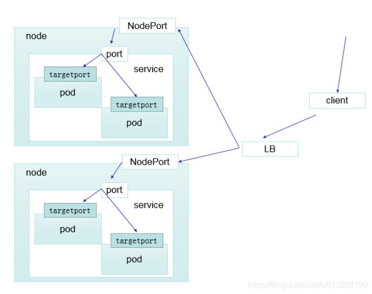

#### ExternalName：
把集群外部的服务引入到集群内部来，在集群内部直接使用。
没有任何类型代理被创建， 这只有 kubernetes 1.7 或更高版本的 kube-dns 才支持
     
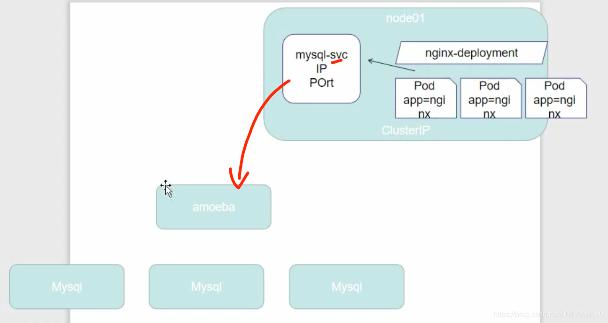

这种类型的 Service 通过返回 CNAME 和它的值，可以将服务映射到 externalName 字段的内容( 例如： hub.atguigu.com )。
ExternalName Service 是 Service 的特例，它没有 selector，也没有定义任何的端口和 Endpoint。
相反的，对于运行在集群外部的服务，它通过返回该外部服务的别名这种方式来提供服务

```yaml
kind: Service
apiVersion: v1
metadata:
  name: svc1
  namespace: default
spec:
  type: ExternalName
  externalName: baidu.com
```

验证是否成功
```shell script
# 获取coredns所在IP
[root@master01 ~]# kubectl get pod -n kube-system -o wide
NAME                                READY   STATUS    RESTARTS   AGE    IP               NODE       NOMINATED NODE   READINESS GATES
coredns-bccdc95cf-8np7j             1/1     Running   7          2d4h   10.244.0.14      master01   <none>           <none>
coredns-bccdc95cf-csp9s             1/1     Running   7          2d4h   10.244.0.15      master01   <none>           <none>

# svc1为服务名称，default为命名空间，@10.244.0.14为coredns所在IP
[root@master01 ~]# dig -t A svc1.default.svc.cluster.local. @10.244.0.14

; <<>> DiG 9.11.4-P2-RedHat-9.11.4-26.P2.el7_9.2 <<>> -t A svc1.default.svc.cluster.local. @10.244.0.14
;; global options: +cmd
;; Got answer:
;; WARNING: .local is reserved for Multicast DNS
;; You are currently testing what happens when an mDNS query is leaked to DNS
# 这里的状态status: NOERROR很重要，这个结果表示成功
;; ->>HEADER<<- opcode: QUERY, status: NOERROR, id: 12174
;; flags: qr aa rd; QUERY: 1, ANSWER: 3, AUTHORITY: 0, ADDITIONAL: 1
;; WARNING: recursion requested but not available

;; OPT PSEUDOSECTION:
; EDNS: version: 0, flags:; udp: 4096
;; QUESTION SECTION:
;svc1.default.svc.cluster.local.	IN	A

# 解析结果，现在表示成功
;; ANSWER SECTION:
svc1.default.svc.cluster.local.	30 IN	CNAME	baidu.com.
baidu.com.		30	IN	A	220.181.38.148
baidu.com.		30	IN	A	39.156.69.79

;; Query time: 10 msec
;; SERVER: 10.244.0.14#53(10.244.0.14)
;; WHEN: 三 12月 02 02:59:32 CST 2020
;; MSG SIZE  rcvd: 162
```
todo:虽然验证成功，但不知道杂用
参考：<https://blog.csdn.net/juwenzhe_hebut/article/details/89577459>
参考：<https://blog.csdn.net/cuipengchong/article/details/71698764>

## ingress

### ingress图解

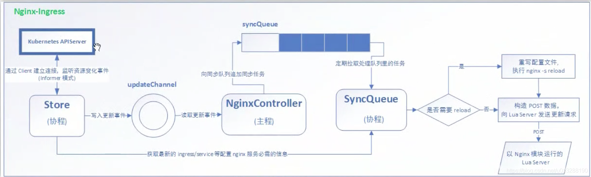

### ingress安装
Ingress-Nginx github 地址：<https://github.com/kubernetes/ingress-nginx>
Ingress-Nginx 官方网站：<https://kubernetes.github.io/ingress-nginx/>

部署 Ingress-Nginx
下载
- <https://github.com/kubernetes/ingress-nginx/blob/nginx-0.30.0/deploy/static/mandatory.yaml>
- <https://github.com/kubernetes/ingress-nginx/blob/nginx-0.30.0/deploy/baremetal/service-nodeport.yaml>
```shell script
kubectl apply -f mandatory.yaml
kubectl apply -f service-nodeport.yaml
```
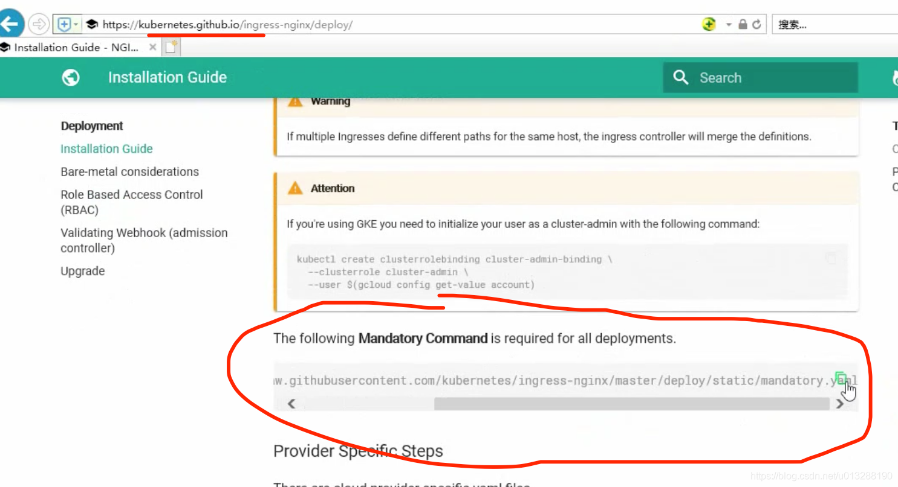
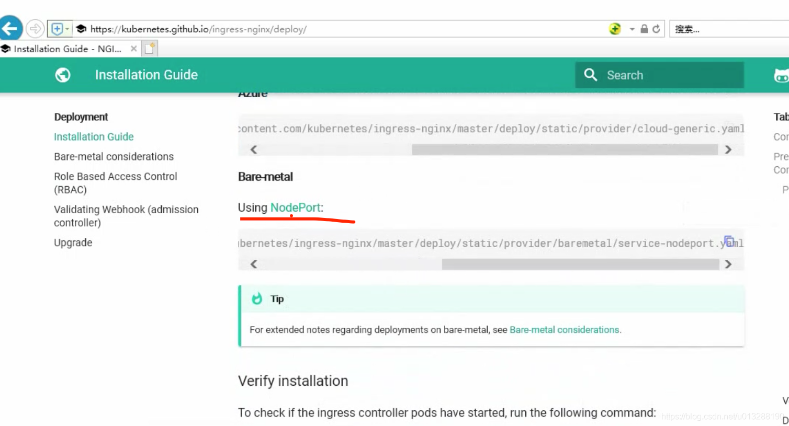

### Ingress HTTP 代理访问
deployment、Service、Ingress Yaml 文件
```yaml
apiVersion: extensions/v1beta1
kind: Deployment
metadata:
  name: nginx-dm
  namespace: ingress-nginx
spec:
  replicas: 2
  template:
    metadata:
      labels:
        name: nginx
    spec:
      containers:
        - name: nginx
          image: registry.cn-hangzhou.aliyuncs.com/neo1303582949/test:v0.1
          imagePullPolicy: IfNotPresent
          ports:
            - containerPort: 80
---
apiVersion: v1
kind: Service
metadata:
  name: nginx-svc
  namespace: ingress-nginx
spec:
  ports:
    - port: 80
      targetPort: 80
      protocol: TCP
  selector:
    name: nginx
---
apiVersion: extensions/v1beta1
kind: Ingress
metadata:
  name: nginx-test
  namespace: ingress-nginx
spec:
  rules:
    - host: www.haha12580.com
      http:
        paths:
        - path: /
          backend:
            serviceName: nginx-svc
            servicePort: 80
```
todo：这里没安装成功，可以直接采用rancher的ingress
检查是否成功
```shell script
kubectl get ingress -n ingress-nginx
kubectl get po -o wide -n ingress-nginx
```


```yaml
apiVersion: extensions/v1beta1
kind: Deployment
metadata:
  name: deployment1
spec:
  replicas: 2
  template:
    metadata:
      labels:
        name: nginx
    spec:
      containers:
        - name: nginx
          image: wangyanglinux/myapp:v1
          imagePullPolicy: IfNotPresent
          ports:
            - containerPort: 80
---
apiVersion: v1
kind: Service
metadata:
  name: svc-1
spec:
  ports:
    - port: 80
      targetPort: 80
      protocol: TCP
  selector:
    name: nginx
```

```yaml
apiVersion: extensions/v1beta1
kind: Ingress
metadata:
  name: ingress1
spec:
  rules:
    - host: www1.atguigu.com
      http:
        paths:
        - path: /
          backend:
            serviceName: svc-1
            servicePort: 80
---
apiVersion: extensions/v1beta1
kind: Ingress
metadata:
  name: ingress2
spec:
  rules:
    - host: www2.atguigu.com
      http:
        paths:
        - path: /
          backend:
            serviceName: svc-2
            servicePort: 80
```

### Ingress HTTPS 代理访问
1.创建证书，以及 cert 存储方式
```shell script
openssl req -x509 -sha256 -nodes -days 365 -newkey rsa:2048 -keyout tls.key -out tls.crt -subj
"/CN=nginxsvc/O=nginxsvc"
kubectl create secret tls tls-secret --key tls.key --cert tls.crt
```

deployment、Service、Ingress Yaml 文件

```yaml
apiVersion: extensions/v1beta1
kind: Ingress
metadata:
  name: nginx-test
spec:
  tls:
    - hosts:
      - foo.bar.com
      secretName: tls-secret
  rules:
    - host: foo.bar.com
      http:
        paths:
        - path: /
          backend:
            serviceName: nginx-svc
            servicePort: 80
```

### Nginx 进行 BasicAuth
```shell script
yum -y install httpd
htpasswd -c auth foo
kubectl create secret generic basic-auth --from-file=auth
```
```yaml
apiVersion: extensions/v1beta1
kind: Ingress
metadata:
  name: ingress-with-auth
  annotations:
    nginx.ingress.kubernetes.io/auth-type: basic
    nginx.ingress.kubernetes.io/auth-secret: basic-auth
    nginx.ingress.kubernetes.io/auth-realm: 'Authentication Required - foo'
spec:
  rules:
  - host: foo2.bar.com
    http:
      paths:
      - path: /
        backend:
          serviceName: nginx-svc
          servicePort: 80
```

### Nginx 进行重写
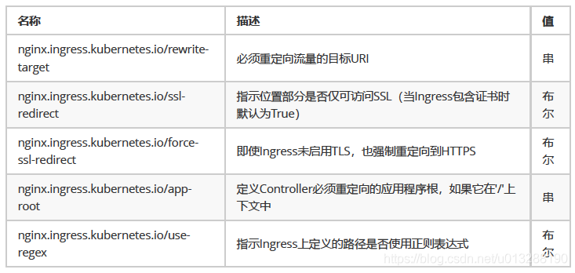
```yaml
apiVersion: extensions/v1beta1
kind: Ingress
metadata:
  name: nginx-test
  annotations:
    nginx.ingress.kubernetes.io/rewrite-target: http://foo.bar.com:31795/hostname.html
spec:
  rules:
  - host: foo10.bar.com
    http:
      paths:
      - path: /
        backend:
          serviceName: nginx-svc
          servicePort: 80
```
参考：<https://blog.csdn.net/u013288190/article/details/110480533>


## 储存

### configMap

#### configMap概念
ConfigMap 功能在 Kubernetes1.2 版本中引入，许多应用程序会从配置文件、命令行参数或环境变量中读取配 置信息。
ConfigMap API 给我们提供了向容器中注入配置信息的机制，ConfigMap 可以被用来保存单个属性，
也 可以用来保存整个配置文件或者 JSON 二进制大对象

#### ConfigMap 的创建

##### 使用目录创建
```yaml
$ ls docs/user-guide/configmap/kubectl/
game.properties
ui.properties
 
 
$ cat docs/user-guide/configmap/kubectl/game.properties
enemies=aliens
lives=3
enemies.cheat=true
enemies.cheat.level=noGoodRotten
secret.code.passphrase=UUDDLRLRBABAS
secret.code.allowed=true
secret.code.lives=30
 
 
$ cat docs/user-guide/configmap/kubectl/ui.properties
color.good=purple
color.bad=yellow
allow.textmode=true
how.nice.to.look=fairlyNice
 
 
$ kubectl create configmap game-config --from-file=docs/user-guide/configmap/kubectl
```
ps：--from-file 指定在目录下的所有文件都会被用在 ConfigMap 里面创建一个键值对，
    键的名字就是文件名，值就 是文件的内容
验证：
```shell script
kubectl get cm
kubectl get cm game-config -o yaml
```

##### 使用文件创建
只要指定为一个文件就可以从单个文件中创建 ConfigMap
```shell script
$ kubectl create configmap game-config-2 --from-file=docs/userguide/configmap/kubectl/game.properties
 
$ kubectl get configmaps game-config-2 -o yaml
```
ps：--from-file 这个参数可以使用多次，
    你可以使用两次分别指定上个实例中的那两个配置文件，效果就跟指定整个 目录是一样的
验证：
```shell script
kubectl describe cm game-config-2
```
##### 使用字面值创建
使用文字值创建，利用 —from-literal 参数传递配置信息，该参数可以使用多次，格式如下
```shell script
$ kubectl create configmap special-config --from-literal=special.how=very --fromliteral=special.type=charm
 
$ kubectl get configmaps special-config -o yaml
```

#### Pod 中使用 ConfigMap
##### 使用 ConfigMap 来替代环境变量
```yaml
apiVersion: v1
kind: ConfigMap
metadata:
  name: special-config
  namespace: default
data:
  special.how: very
  special.type: charm
---
apiVersion: v1
kind: ConfigMap
metadata:
  name: env-config
  namespace: default
data:
  log_level: INFO
```

```yaml
apiVersion: v1
kind: Pod
metadata:
  name: dapi-test-pod
spec:
  containers:
    - name: test-container
      # 声明变量的作用就是，该容器可以用这些变量
      image: registry.cn-hangzhou.aliyuncs.com/neo1303582949/test:v0.1
      command: [ "/bin/bash", "-c", "env" ]
      env:
          # name是环境变量键
        - name: SPECIAL_LEVEL_KEY
          valueFrom:
            configMapKeyRef:
              # 环境变量值来自于configMap中的special-config里的键为special.how对应的值
              name: special-config
              key: special.how
        - name: SPECIAL_TYPE_KEY
          valueFrom:
            configMapKeyRef:
              name: special-config
              key: special.type
      envFrom:
        - configMapRef:
            # 环境变量中的键和值分别来自于env-config中定义的键和值
            name: env-config
  restartPolicy: Never
```

##### 用 ConfigMap 设置命令行参数

```yaml
apiVersion: v1
kind: ConfigMap
metadata:
  name: special-config
  namespace: default
data:
  special.how: very
  special.type: charm
```

```yaml
apiVersion: v1
kind: Pod
metadata:
  name: dapi-test-pod
spec:
  containers:
    - name: test-container
      image: hub.atguigu.com/library/myapp:v1
      command: [ "/bin/sh", "-c", "echo $(SPECIAL_LEVEL_KEY) $(SPECIAL_TYPE_KEY)" ]
      env:
        - name: SPECIAL_LEVEL_KEY
          valueFrom:
            configMapKeyRef:
              name: special-config
              key: special.how
        - name: SPECIAL_TYPE_KEY
          valueFrom:
            configMapKeyRef:
              name: special-config
              key: special.type
  restartPolicy: Never
```

##### 通过数据卷插件使用ConfigMap
```yaml
apiVersion: v1
kind: ConfigMap
metadata:
  name: special-config
  namespace: default
data:
  special.how: very
  special.type: charm
```
在数据卷里面使用这个 ConfigMap，有不同的选项。
最基本的就是将文件填入数据卷，在这个文件中，键就是文 件名，键值就是文件内容
```yaml

apiVersion: v1
kind: Pod
metadata:
  name: dapi-test-pod
spec:
  containers:
    - name: test-container
      image: hub.atguigu.com/library/myapp:v1
      command: [ "/bin/sh", "-c", "cat /etc/config/special.how" ]
      volumeMounts:
    - name: config-volume
      mountPath: /etc/config
  volumes:
    - name: config-volume
      configMap:
        name: special-config
  restartPolicy: Never
```

#### ConfigMap 的热更新
```yaml
apiVersion: v1
kind: ConfigMap
metadata:
  name: log-config
  namespace: default
data:
  log_level: INFO
---
apiVersion: extensions/v1beta1
kind: Deployment
metadata:
  name: my-nginx
spec:
  replicas: 1
  template:
    metadata:
      labels:
        run: my-nginx
    spec:
      containers:
      - name: my-nginx
        image: hub.atguigu.com/library/myapp:v1
        ports:
        - containerPort: 80
        volumeMounts:
        - name: config-volume
          mountPath: /etc/config
      volumes:
        - name: config-volume
          configMap:
            name: log-config
```
验证：
```shell script
$ kubectl exec `kubectl get pods -l run=my-nginx -o=name|cut -d "/" -f2` cat
/etc/config/log_level
INFO
```
修改 ConfigMap
```shell script
$ kubectl edit configmap log-config
```
修改 log_level 的值为 DEBUG 等待大概 10 秒钟时间，再次查看环境变量的值
```shell script
$ kubectl exec `kubectl get pods -l run=my-nginx -o=name|cut -d "/" -f2` cat /tmp/log_level
DEBUG
```

ConfigMap 更新后滚动更新 Pod 更新 ConfigMap 目前并不会触发相关 Pod 的滚动更新，可以通过修改 pod annotations 的方式强制触发滚动更新
```shell script
$ kubectl patch deployment my-nginx --patch '{"spec": {"template": {"metadata": {"annotations":
{"version/config": "20190411" }}}}}'
```
这个例子里我们在 `.spec.template.metadata.annotations` 中添加 `version/config` ，每次通过修改 version/config 来触发滚动更新

！！！ 更新 ConfigMap 后：

- 使用该 ConfigMap 挂载的 Env 不会同步更新
- 使用该 ConfigMap 挂载的 Volume 中的数据需要一段时间（实测大概10秒）才能同步更新

### Secret
Secret 存在意义
Secret 解决了密码、token、密钥等敏感数据的配置问题，而不需要把这些敏感数据暴露到镜像或者 Pod Spec中。
Secret 可以以 Volume 或者环境变量的方式使用

Secret 有三种类型：
- Service Account ：用来访问 Kubernetes API，由 Kubernetes 自动创建，
                    并且会自动挂载到 Pod 的/run/secrets/kubernetes.io/serviceaccount 目录中
- Opaque ：base64编码格式的Secret，用来存储密码、密钥等
- kubernetes.io/dockerconfigjson ：用来存储私有 docker registry 的认证信息


#### Service Account
Service Account 用来访问 Kubernetes API，由 Kubernetes 自动创建，
并且会自动挂载到 Pod的/run/secrets/kubernetes.io/serviceaccount 目录中
```shell script
$ kubectl run nginx --image nginx
deployment "nginx" created

$ kubectl get pods
NAME READY STATUS RESTARTS AGE
nginx-3137573019-md1u2 1/1 Running 0 13s

$ kubectl exec nginx-3137573019-md1u2 ls /run/secrets/kubernetes.io/serviceaccount
ca.crt
namespace
token
```

#### Opaque Secret
创建说明
Opaque 类型的数据是一个 map 类型，要求 value 是 base64 编码格式：
```shell script
$ echo -n "admin" | base64
YWRtaW4=
$ echo -n "1f2d1e2e67df" | base64
MWYyZDFlMmU2N2Rm
```

secrets.yml
```yaml
apiVersion: v1
kind: Secret
metadata:
  name: mysecret
type: Opaque
data:
  password: MWYyZDFlMmU2N2Rm
  username: YWRtaW4=
```
创建secret：`kubectl create -f secrets.yml`

使用secret：将 Secret 挂载到 Volume 中
```yaml

apiVersion: v1
kind: Pod
metadata:
  labels:
    name: secret-test
  name: secret-test
spec:
  volumes:
  - name: secrets
    secret:
      # 关联决堤的secret
      secretName: mysecret
  containers:
  - image: registry.cn-hangzhou.aliyuncs.com/neo1303582949/test:v0.1
    name: db
    volumeMounts:
    - name: secrets
      mountPath: "/etc/secrets"
      readOnly: true
```
验证：可以进入容器中，查看`/etc/secrets`

另一种使用方式：将 Secret 导出到环境变量中
```yaml
apiVersion: extensions/v1beta1
kind: Deployment
metadata:
  name: pod-deployment
spec:
  replicas: 2
  template:
    metadata:
      labels:
        app: pod-deployment
    spec:
     containers:
     - name: pod-1
       image: hub.atguigu.com/library/myapp:v1
       ports:
       - containerPort: 80
       env:
       - name: TEST_USER
         valueFrom:
           secretKeyRef:
             name: mysecret
             key: username
       - name: TEST_PASSWORD
         valueFrom:
           secretKeyRef:
             name: mysecret
             key: password
```

#### kubernetes.io/dockerconfigjson
 使用 Kuberctl 创建 docker registry 认证的 secret
```shell script
$ kubectl create secret docker-registry myregistrykey --docker-server=DOCKER_REGISTRY_SERVER --
docker-username=DOCKER_USER --docker-password=DOCKER_PASSWORD --docker-email=DOCKER_EMAIL
secret "myregistrykey" created.
```
ps：myregistrykey是自定义名称
ps：DOCKER_REGISTRY_SERVER，DOCKER_USER，DOCKER_PASSWORD，DOCKER_EMAIL为私有仓库地址，用户名，密码，邮箱

在创建 Pod 的时候，通过 imagePullSecrets 来引用刚创建的 `myregistrykey`
```yaml
apiVersion: v1
kind: Pod
metadata:
  name: foo
spec:
  containers:
    - name: foo
      image: roc/awangyang:v1
  # 这里使用上面产生的secret，名为：myregistrykey
  imagePullSecrets:
    - name: myregistrykey
```
ps：这样就可以直接下载私有仓库中的镜像


### Volume

#### 背景
容器磁盘上的文件的生命周期是短暂的，这就使得在容器中运行重要应用时会出现一些问题。
首先，当容器崩溃时，kubelet 会重启它，但是容器中的文件将丢失——容器以干净的状态（镜像最初的状态）重新启动。
其次，在Pod 中同时运行多个容器时，这些容器之间通常需要共享文件。
Kubernetes 中的 Volume 抽象就很好的解决了这些问题。

Kubernetes 中的卷有明确的寿命 —— 与封装它的 Pod 相同。所f以，卷的生命比 Pod 中的所有容器都长，当这个容器重启时数据仍然得以保存。当然，当 Pod 不再存在时，卷也将不复存在。
也许更重要的是，Kubernetes支持多种类型的卷，Pod 可以同时使用任意数量的卷。

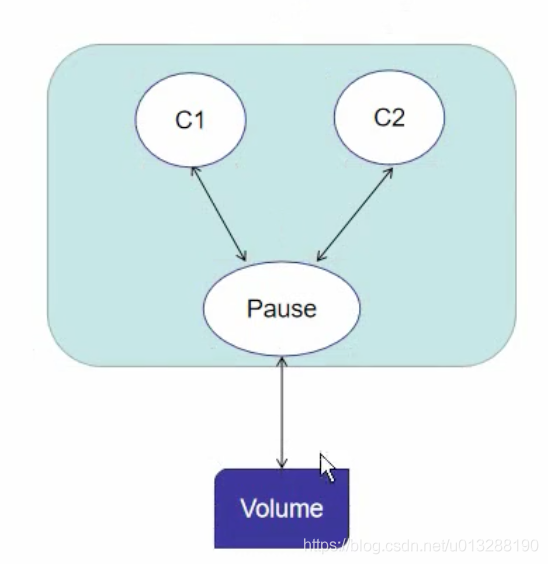


#### 卷的类型
Kubernetes 支持以下类型的卷：
     
awsElasticBlockStore azureDisk azureFile cephfs csi downwardAPI emptyDir
fc flocker gcePersistentDisk gitRepo glusterfs hostPath iscsi local nfs
persistentVolumeClaim projected portworxVolume quobyte rbd scaleIO secret
storageos vsphereVolume

#### emptyDir
当 Pod 被分配给节点时，首先创建 emptyDir 卷，**并且只要该 Pod 在该节点上运行，
该卷就会存在**。正如卷的名字所述，它最初是空的。Pod 中的容器可以读取和写入 emptyDir 卷中的相同文件，
尽管该卷可以挂载到每个容器中的相同或不同路径上。

- 当出于任何原因从节点中删除 Pod 时， emptyDir 中的数据将被永久删除。
- 容器崩溃不会从节点中移除pod，因此emptyDir卷中的数据在容器崩溃时是安全的。
ps：相当于Pod级别的存储
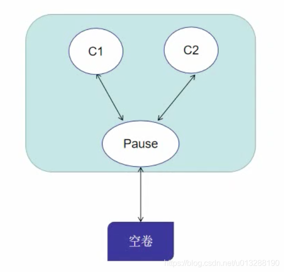

emptyDir 的用法有：

- 暂存空间，例如用于基于磁盘的合并排序
- 用作长时间计算崩溃恢复时的检查点
- Web服务器容器提供数据时，保存内容管理器容器提取的文件
```yaml
apiVersion: v1
kind: Pod
metadata:
  name: test-pd
spec:
  containers:
  - image: k8s.gcr.io/test-webserver
    name: test-container
    volumeMounts:
    - mountPath: /cache
      name: cache-volume
  volumes:
  - name: cache-volume
    emptyDir: {}
```

#### hostPath
hostPath 卷将主机节点的文件系统中的文件或目录挂载到集群中；
ps：容器中的目录与主机关联，注意是指Pod所在的节点的目录
ps：相当于主机级别的存储

hostPath 的用途如下：

- 运行需要访问 Docker 内部的容器；使用 /var/lib/docker 的 hostPath
- 在容器中运行 cAdvisor；使用 /dev/cgroups 的 hostPath
- 允许 pod 指定给定的 hostPath 是否应该在 pod 运行之前存在，是否应该创建，以及它应该以什么形式存在
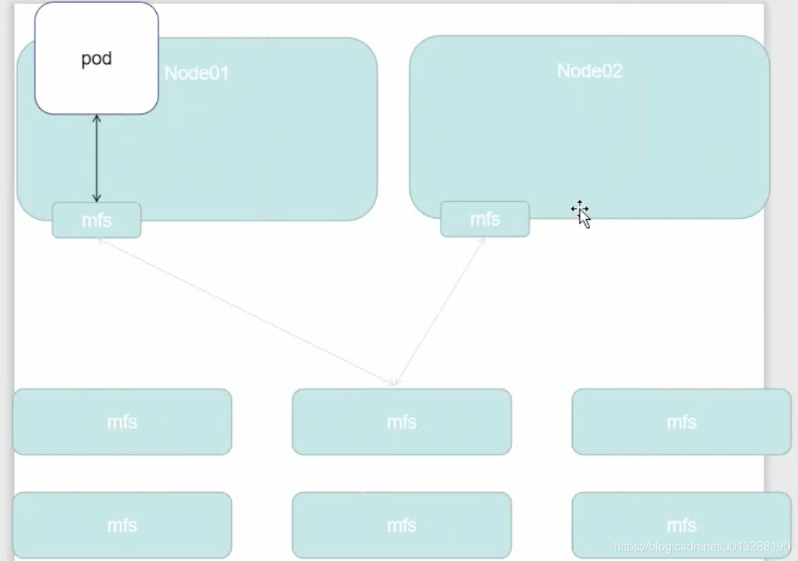

除了所需的 path 属性之外，用户还可以为 hostPath 卷指定 type
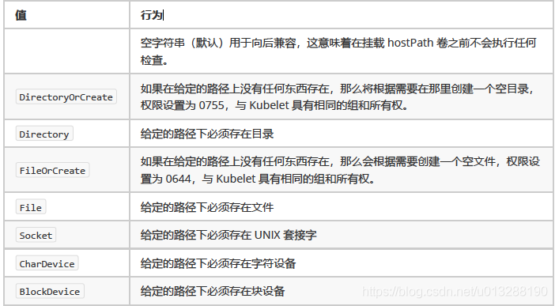

使用这种卷类型是请注意，因为：

- 由于每个节点上的文件都不同，具有相同配置（例如从 podTemplate 创建的）的 pod 在不同节点上的行为可能会有所不同
- 当 Kubernetes 按照计划添加资源感知调度时，将无法考虑 hostPath 使用的资源
- 在底层主机上创建的文件或目录只能由 root 写入。您需要在特权容器中以 root 身份运行进程，或修改主机上的文件权限以便写入 hostPath 卷
```yaml
apiVersion: v1
kind: Pod
metadata:
  name: test-pd
spec:
  containers:
  - image: registry.cn-hangzhou.aliyuncs.com/neo1303582949/test:v0.1
    name: test-container
    volumeMounts:
    - mountPath: /test-pd
      name: test-volume
  volumes:
  - name: test-volume
    hostPath:
      # directory location on host
      path: /data
      # this field is optional
      type: Directory
```
ps：node节点创建要挂载的文件夹
参考：<https://blog.csdn.net/u013288190/article/details/110652210>

### PV和PVC
#### 一、概念
##### 1. PersistentVolume （PV）
PV：是由管理员设置的存储，它是群集的一部分。就像节点是集群中的资源一样，PV 也是集群中的资源。
PV 是Volume 之类的卷插件，但具有独立于使用 PV 的 Pod 的生命周期。

此 API 对象包含存储实现的细节，即 NFS、iSCSI 或特定于云供应商的存储系统。
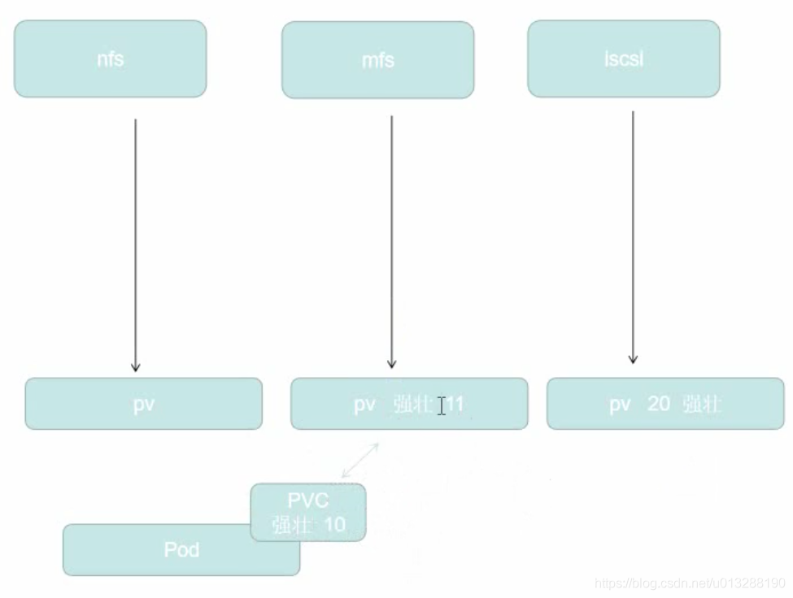

##### 2. PersistentVolumeClaim （PVC）
是用户存储的请求。它与 Pod 相似。Pod 消耗节点资源，PVC 消耗 PV 资源。
Pod 可以请求特定级别的资源（CPU 和内存）。

声明可以请求特定的大小和访问模式（例如，可以以读/写一次或 只读多次模式挂载）

 

##### 3. 静态 pv
集群管理员创建一些 PV。它们带有可供群集用户使用的实际存储的细节。
它们存在于 Kubernetes API 中，可用于消费。

##### 4. 动态
当管理员创建的静态 PV 都不匹配用户的 PersistentVolumeClaim 时，集群可能会尝试动态地为 PVC 创建卷。

此配置基于 StorageClasses ：PVC 必须请求 [存储类]，并且管理员必须创建并配置该类才能进行动态创建。
声明该类为 "" 可以有效地禁用其动态配置要启用基于存储级别的动态存储配置，集群管理员需要启用 API server 上的 DefaultStorageClass [准入控制器]。
例如，通过确保 DefaultStorageClass 位于 API server 组件的 --admission-control 标志，
使用逗号分隔的有序值列表中，可以完成此操作。

##### 5. 绑定
master 中的控制环路监视新的 PVC，寻找匹配的 PV（如果可能），并将它们绑定在一起。
如果为新的 PVC 动态调配 PV，则该环路将始终将该 PV 绑定到 PVC。

否则，用户总会得到他们所请求的存储，但是容量可能超出要求的数量。
一旦 PV 和 PVC 绑定后， PersistentVolumeClaim 绑定是排他性的，不管它们是如何绑定的。

PVC 跟PV 绑定是一对一的映射

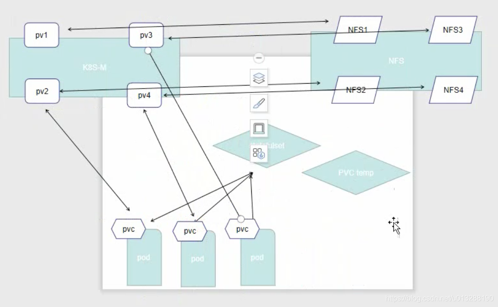

#### 二、持久化卷声明的保护
PVC 保护的目的是确保由 pod 正在使用的 PVC 不会从系统中移除，因为如果被移除的话可能会导致数据丢失。

注意：当Pod状态为pending并且pod已经分配给节点或pod为running状态时，pvc处于活动状态。

当启用PVC 保护 alpha 功能时，如果用户删除了一个 pod 正在使用的 PVC，则该 PVC 不会被立即删除。
PVC 的删除将被推迟，直到 PVC 不再被任何 pod 使用

#### 三、持久化卷类型
PersistentVolume 类型以插件形式实现。

Kubernetes 目前支持以下插件类型：

GCEPersistentDisk AWSElasticBlockStore AzureFile AzureDisk FC (Fibre Channel)
FlexVolume Flocker NFS iSCSI RBD (Ceph Block Device) CephFS
Cinder (OpenStack block storage) Glusterfs VsphereVolume Quobyte Volumes
HostPath VMware Photon Portworx Volumes ScaleIO Volumes StorageOS

持久卷演示代码
```yaml

apiVersion: v1
kind: PersistentVolume
metadata:
  name: pv0003
spec:
  capacity:
    storage: 5Gi
  volumeMode: Filesystem
  accessModes:
    - ReadWriteOnce
  persistentVolumeReclaimPolicy: Recycle
  storageClassName: slow
  mountOptions:
    - hard
    - nfsvers=4.1
  nfs:
    path: /tmp
    server: 172.17.0.2
```

#### 四、PV 访问模式
PersistentVolume 可以以资源提供者支持的任何方式挂载到主机上。如下表所示，供应商具有不同的功能，每个PV 的访问模式都将被设置为该卷支持的特定模式。例如，NFS 可以支持多个读/写客户端，但特定的 NFS PV 可能以只读方式导出到服务器上。每个 PV 都有一套自己的用来描述特定功能的访问模式

- ReadWriteOnce——该卷可以被单个节点以读/写模式挂载
- ReadOnlyMany——该卷可以被多个节点以只读模式挂载
- ReadWriteMany——该卷可以被多个节点以读/写模式挂载


在命令行中，访问模式缩写为：

- RWO - ReadWriteOnce
- ROX - ReadOnlyMany
- RWX - ReadWriteMany
一个卷一次只能使用一种访问模式挂载，即使它支持很多访问模式。
例如，GCEPersistentDisk可以由单个节点作为ReadWriteOnce模式挂载，
或由多个节点以ReadOnlyMany模式挂载，但不能同时挂载。
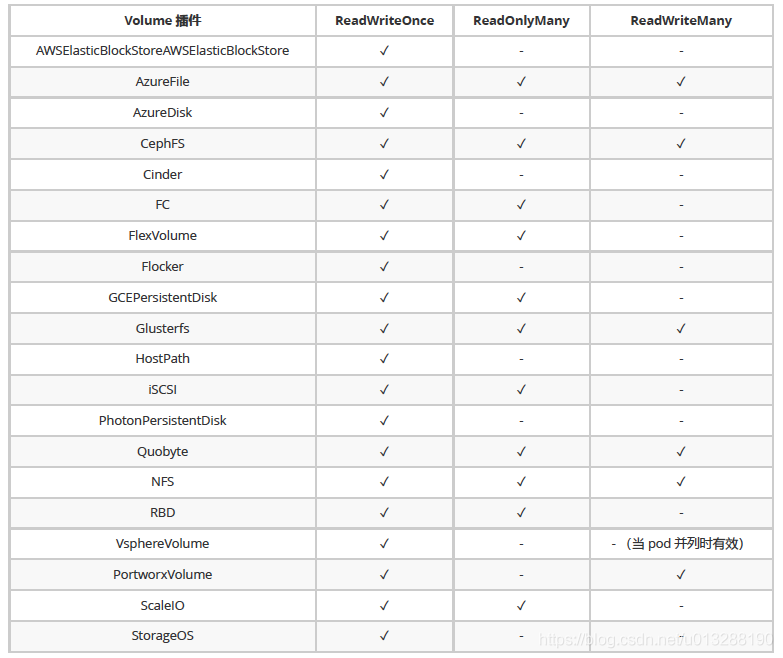  

#### 五、回收策略
- Retain（保留）——手动回收
- Recycle（回收）——基本擦除（ rm -rf /thevolume/* ）; ps：好像新版本淘汰了这个
- Delete（删除）——关联的存储资产（例如 AWS EBS、GCE PD、Azure Disk 和 OpenStack Cinder 卷）将被删除
当前，只有 NFS 和 HostPath 支持回收策略。AWS EBS、GCE PD、Azure Disk 和 Cinder 卷支持删除策略


#### 六、状态
卷可以处于以下的某种状态：

Available（可用）——一块空闲资源还没有被任何声明绑定
Bound（已绑定）——卷已经被声明绑定
Released（已释放）——声明被删除，但是资源还未被集群重新声明
Failed（失败）——该卷的自动回收失败
命令行会显示绑定到 PV 的 PVC 的名称


#### 七、持久化演示说明 - NFS
##### Ⅰ、安装 NFS 服务器
```shell script
yum install -y nfs-common nfs-utils rpcbind
mkdir /nfsdata
chmod 666 /nfsdata
chown nfsnobody /nfsdata
cat /etc/exports
 /nfsdata *(rw,no_root_squash,no_all_squash,sync)
systemctl start rpcbind
systemctl start nfs
```
在非k8s节点（如harbor节点）安装nfs服务器
启动harbor

##### Ⅱ、部署 PV
```yaml
apiVersion: v1
kind: PersistentVolume
metadata:
  name: nfspv1
spec:
  capacity:
    storage: 1Gi
  accessModes:
    - ReadWriteOnce
  persistentVolumeReclaimPolicy: Recycle
  storageClassName: nfs
  nfs:
    path: /data/nfs
    server: 10.66.66.10
```
##### Ⅲ、创建服务并使用 PVC
```yaml
apiVersion: v1
kind: Service
metadata:
  name: nginx
  labels:
    app: nginx
spec:
  ports:
  - port: 80
    name: web
  clusterIP: None
  selector:
    app: nginx
---
apiVersion: apps/v1
kind: StatefulSet
metadata:
  name: web
spec:
  selector:
    matchLabels:
      app: nginx
  serviceName: "nginx"
  replicas: 3
  template:
    metadata:
      labels:
        app: nginx
    spec:
      containers:
      - name: nginx
        image: k8s.gcr.io/nginx-slim:0.8
        ports:
        - containerPort: 80
          name: web
        volumeMounts:
        - name: www
          mountPath: /usr/share/nginx/html
  volumeClaimTemplates:
  - metadata:
      name: www
    spec:
      accessModes: [ "ReadWriteOnce" ]
      storageClassName: "nfs"
      resources:
        requests:
          storage: 1Gi
```


####  八、关于 StatefulSet
##### 1. 特点
- 匹配 Pod name ( 网络标识 ) 的模式为：$(statefulset名称)-$(序号)，
  比如上面的示例：web-0，web-1，web-2
  
- StatefulSet 为每个 Pod 副本创建了一个 DNS 域名，
  这个域名的格式为： $(podname).(headless server name)，也就意味着服务间是通过Pod域名来通信而非 Pod IP，
  因为当Pod所在Node发生故障时， Pod 会被飘移到其它 Node 上，Pod IP 会发生变化，但是 Pod 域名不会有变化

- StatefulSet 使用 Headless 服务来控制 Pod 的域名，
  这个域名的 FQDN 为：$(service name).$(namespace).svc.cluster.local，
  其中，“cluster.local” 指的是集群的域名

- 根据 volumeClaimTemplates，为每个 Pod 创建一个 pvc，
  pvc 的命名规则匹配模式：(volumeClaimTemplates.name)-(pod_name)，
  比如上面的 volumeMounts.name=www， Pod name=web-[0-2]，
  因此创建出来的 PVC 是 www-web-0、www-web-1、www-web-2
  
- 删除 Pod 不会删除其 pvc，手动删除 pvc 将自动释放 pv


##### 2. Statefulset的启停顺序：
- 有序部署：部署StatefulSet时，如果有多个Pod副本，它们会被顺序地创建（从0到N-1）并且，
  在下一个Pod运行之前所有之前的Pod必须都是Running和Ready状态。
- 有序删除：当Pod被删除时，它们被终止的顺序是从N-1到0。
- 有序扩展：当对Pod执行扩展操作时，与部署一样，它前面的Pod必须都处于Running和Ready状态。

##### 3. StatefulSet使用场景：
- 稳定的持久化存储，即Pod重新调度后还是能访问到相同的持久化数据，基于 PVC 来实现。
- 稳定的网络标识符，即 Pod 重新调度后其 PodName 和 HostName 不变。
- 有序部署，有序扩展，基于 init containers 来实现。
- 有序收缩。

##### 4. 彻底删除pv\pvc
- 需要手动删除释放
- 需要手动回收

参考：<https://blog.csdn.net/u013288190/article/details/110714614>


## 集群调度

### 调度过程说明
#### 一、简介
Scheduler 是 kubernetes 的调度器，主要的任务是把定义的 pod 分配到集群的节点上。

听起来非常简单，但有很多要考虑的问题：

公平：如何保证每个节点都能被分配资源
资源高效利用：集群所有资源最大化被使用
效率：调度的性能要好，能够尽快地对大批量的 pod 完成调度工作
灵活：允许用户根据自己的需求控制调度的逻辑
Sheduler 是作为单独的程序运行的，启动之后会一直坚挺 API Server，获取 Pod.Spec.NodeName 为空的 pod，

对每个 pod 都会创建一个 binding，表明该 pod 应该放到哪个节点上。
    
     
    
#### 二、调度过程
1. 调度分为几个部分：
首先是过滤掉不满足条件的节点，这个过程称为 predicate ；
然后对通过的节点按照优先级排序，这个是 priority ；
最后从中选择优先级最高的节点。如果中间任何一步骤有错误，就直接返回错误。
 
2. Predicate 有一系列的算法可以使用：
- PodFitsResources ：节点上剩余的资源是否大于 pod 请求的资源
- PodFitsHost ：如果 pod 指定了 NodeName，检查节点名称是否和 NodeName 匹配
- PodFitsHostPorts ：节点上已经使用的 port 是否和 pod 申请的 port 冲突
- PodSelectorMatches ：过滤掉和 pod 指定的 label 不匹配的节点
- NoDiskConflict ：已经 mount 的 volume 和 pod 指定的 volume 不冲突，除非它们都是只读
 

如果在 predicate 过程中没有合适的节点，pod 会一直在 pending 状态，不断重试调度，直到有节点满足条件。

经过这个步骤，如果有多个节点满足条件，就继续 priorities 过程： 按照优先级大小对节点排序

 

3.  priorities 过程
优先级由一系列键值对组成，键是该优先级项的名称，值是它的权重（该项的重要性）。

这些优先级选项包括：

- LeastRequestedPriority ：通过计算 CPU 和 Memory 的使用率来决定权重，使用率越低权重越高。换句话说，这个优先级指标倾向于资源使用比例更低的节点
- BalancedResourceAllocation ：节点上 CPU 和 Memory 使用率越接近，权重越高。这个应该和上面的LeastRequestedPriority一起使用，不应该单独使用
- ImageLocalityPriority ：倾向于已经有要使用镜像的节点，镜像总大小值越大，权重越高
通过算法对所有的优先级项目和权重进行计算，得出最终的结果
    
     
    
#### 三、自定义调度器
除了 kubernetes 自带的调度器，你也可以编写自己的调度器。通过 spec:schedulername 参数指定调度器的名字，可以为 pod 选择某个调度器进行调度。
比如下面的 pod 选择 my-scheduler 进行调度，而不是默认的default-scheduler ：
```yaml
apiVersion: v1
kind: Pod
metadata:
  name: annotation-second-scheduler
  labels:
    name: multischeduler-example
spec:
  schedulername: my-scheduler
  containers:
  - name: pod-with-second-annotation-container
    image: gcr.io/google_containers/pause:2.0
```

### 亲和性
#### 一、节点亲和性
##### 1. pod.spec.nodeAffinity
- preferredDuringSchedulingIgnoredDuringExecution：软策略
- requiredDuringSchedulingIgnoredDuringExecution：硬策略
 

##### 2. requiredDuringSchedulingIgnoredDuringExecution
```yaml
apiVersion: v1
kind: Pod
metadata:
  name: affinity
  labels:
    app: node-affinity-pod
spec:
  containers:
    - name: with-node-affinity
      image: hub.atguigu.com/library/myapp:v1
  affinity:
    nodeAffinity:
      requiredDuringSchedulingIgnoredDuringExecution:
        nodeSelectorTerms:
        - matchExpressions:
          - key: kubernetes.io/hostname
            operator: NotIn
            values:
            - k8s-node02
```

##### 3. preferredDuringSchedulingIgnoredDuringExecution
```yaml
apiVersion: v1
kind: Pod
metadata:
  name: affinity
  labels:
    app: node-affinity-pod
spec:
  containers:
  - name: with-node-affinity
    image: hub.atguigu.com/library/myapp:v1
  affinity:
    nodeAffinity:
      preferredDuringSchedulingIgnoredDuringExecution:
      - weight: 1
        preference:
          matchExpressions:
          - key: source
            operator: In
            values:
            - qikqiak
```

##### 4. 合体
```yaml
apiVersion: v1
kind: Pod 
metadata:
  name: affinity
  labels:
    app: node-affinity-pod
spec:
  containers:
  - name: with-node-affinity
    image: hub.atguigu.com/library/myapp:v1
  affinity:
    nodeAffinity:
      requiredDuringSchedulingIgnoredDuringExecution:
        nodeSelectorTerms:
        - matchExpressions:
          - key: kubernetes.io/hostname
            operator: NotIn
            values:
              - k8s-node02
      preferredDuringSchedulingIgnoredDuringExecution:
      - weight: 1
        preference:
          matchExpressions:
          - key: source
            operator: In
            values:
            - qikqiak
```
如果nodeSelectorTerms下面有多个选项的话，满足任何一个条件就可以了；

如果matchExpressions有多个选项的话，就必须同时满足这些条件才能正常调度pod

##### 5. 键值运算关系
- In：label 的值在某个列表中
- NotIn：label 的值不在某个列表中
- Gt：label 的值大于某个值
- Lt：label 的值小于某个值
- Exists：某个 label 存在
- DoesNotExist：某个 label 不存在

#### 二、Pod 亲和性（Pod和Pod之间）
##### 1. pod.spec.affinity.podAffinity/podAntiAffinity
- preferredDuringSchedulingIgnoredDuringExecution：软策略
- requiredDuringSchedulingIgnoredDuringExecution：硬策略
 
```yaml
apiVersion: v1
kind: Pod
metadata:
  name: pod-3
  labels:
    app: pod-3
spec:
  containers:
  - name: pod-3
    image: hub.atguigu.com/library/myapp:v1
  affinity:
    podAffinity:
      requiredDuringSchedulingIgnoredDuringExecution:
      - labelSelector:
          matchExpressions:
          - key: app
            operator: In
            values:
            - pod-1
        topologyKey: kubernetes.io/hostname
    podAntiAffinity:
      preferredDuringSchedulingIgnoredDuringExecution:
      - weight: 1
        podAffinityTerm:
          labelSelector:
            matchExpressions:
            - key: app
              operator: In
              values:
              - pod-2
          topologyKey: kubernetes.io/hostname
```
##### 2. 亲和性/反亲和性调度策略比较如下：
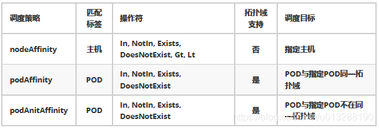

### 污点和容忍
#### 一、Taint 和 Toleration
##### 1. 优先选择什么
节点亲和性，是 pod 的一种属性（偏好或硬性要求），它使 pod 被吸引到一类特定的节点。
Taint 则相反，它使节点 能够 排斥 一类特定的 pod。

 

##### 2. 不选择什么
Taint 和 toleration 相互配合，可以用来避免 pod 被分配到不合适的节点上。
每个节点上都可以应用一个或多个taint ，这表示对于那些不能容忍这些 taint 的 pod，是不会被该节点接受的。
如果将 toleration 应用于 pod上，则表示这些 pod 可以（但不要求）被调度到具有匹配 taint 的节点上。

 
#### 二、污点(Taint)
##### Ⅰ、 污点 ( Taint ) 的组成
使用 kubectl taint 命令可以给某个 Node 节点设置污点，
Node 被设置上污点之后就和 Pod 之间存在了一种相斥的关系，可以让 Node 拒绝 Pod 的调度执行，
甚至将 Node 已经存在的 Pod 驱逐出去

每个污点的组成如下：
```
key=value:effect
```

每个污点有一个 key 和 value 作为污点的标签，其中 value 可以为空，effect 描述污点的作用。

当前 taint effect 支持如下三个选项：

- NoSchedule ：表示 k8s 将不会将 Pod 调度到具有该污点的 Node 上
- PreferNoSchedule ：表示 k8s 将尽量避免将 Pod 调度到具有该污点的 Node 上
- NoExecute ：表示 k8s 将不会将 Pod 调度到具有该污点的 Node 上，同时会将 Node 上已经存在的 Pod 驱逐出去
 
##### Ⅱ、污点的设置、查看和去除
```shell script
# 设置污点
kubectl taint nodes node1 key1=value1:NoSchedule
 
# 节点说明中，查找 Taints 字段
kubectl describe pod pod-name
```

```shell script
# 去除污点
kubectl taint nodes node1 key1:NoSchedule
```

#### 三、容忍(Tolerations)
设置了污点的 Node 将根据 taint 的 effect：NoSchedule、PreferNoSchedule、NoExecute 和 Pod 之间产生互斥的关系，
Pod 将在一定程度上不会被调度到 Node 上。

但我们可以在 Pod 上设置容忍 ( Toleration ) ，意思是设置了容忍的 Pod 将可以容忍污点的存在，
可以被调度到存在污点的 Node 上

pod.spec.tolerations
```yaml
tolerations:
- key: "key1"
  operator: "Equal"
  value: "value1"
  effect: "NoSchedule"
  tolerationSeconds: 3600
- key: "key1"
  operator: "Equal"
  value: "value1"
  effect: "NoExecute"
- key: "key2"
  operator: "Exists"
  effect: "NoSchedule"
```
- 其中 key, vaule, effect 要与 Node 上设置的 taint 保持一致
- operator 的值为 Exists 将会忽略 value 值
- tolerationSeconds 用于描述当 Pod 需要被驱逐时可以在 Pod 上继续保留运行的时间

##### Ⅰ、当不指定 key 值时，表示容忍所有的污点 key：
```yaml
tolerations:
- operator: "Exists"
```

##### Ⅱ、当不指定 effect 值时，表示容忍所有的污点作用
```yaml
tolerations:
- key: "key"
 operator: "Exists"
```
##### Ⅲ、有多个 Master 存在时，防止资源浪费，可以如下设置
```yaml
kubectl taint nodes Node-Name node-role.kubernetes.io/master=:PreferNoSchedule
```

### 固定节点调度

#### 一、指定调度节点
##### Ⅰ、Pod.spec.nodeName
Pod.spec.nodeName 将 Pod 直接调度到指定的 Node 节点上，会跳过 Scheduler 的调度策略，该匹配规则是强制匹配

```yaml
apiVersion: extensions/v1beta1
kind: Deployment
metadata:
  name: myweb
spec:
  replicas: 7
  template:
    metadata:
      labels:
        app: myweb
    spec:
      nodeName: k8s-node01
      containers:
      - name: myweb
        image: hub.atguigu.com/library/myapp:v1
        ports:
        - containerPort: 80
```

##### Ⅱ、Pod.spec.nodeSelector
Pod.spec.nodeSelector通过 kubernetes 的 label-selector 机制选择节点，由调度器调度策略匹配 label，
而后调度 Pod 到目标节点，该匹配规则属于强制约束
```yaml
apiVersion: extensions/v1beta1
kind: Deployment
metadata:
  name: myweb
spec:
  replicas: 2
  template:
    metadata:
      labels:
        app: myweb
    spec:
      nodeSelector:
        type: backEndNode1
      containers:
      - name: myweb
        image: harbor/tomcat:8.5-jre8
        ports:
        - containerPort: 80
```

## 认证
kubeadm安装默认自动签发了证书
参考：<https://www.bilibili.com/video/BV1w4411y7Go?p=53>

## Helm
参考：<https://github.com/whmzsu/helm-doc-zh-cn>
参考：<https://www.bilibili.com/video/BV1w4411y7Go?p=58>
概念：类似于yum的安装包工具

### 安装国内源
1、删除默认的源
`helm repo remove stable`
2、增加新的国内镜像源
`helm repo add stable https://burdenbear.github.io/kube-charts-mirror/`
或者
`helm repo add stable https://kubernetes.oss-cn-hangzhou.aliyuncs.com/charts`
3、查看helm源添加情况
`helm repo list`
4、搜索测试
```
helm repo update
helm search mysql
```

### Helm安全
参考：<https://github.com/whmzsu/helm-doc-zh-cn/blob/master/quickstart/securing_installation-zh_cn.md>


### 安装本地yaml


### Helm命令

#### `helm repo`
```shell script
Usage:
  helm repo [command]

Available Commands:
  add         add a chart repository
  index       generate an index file given a directory containing packaged charts
  list        list chart repositories
  remove      remove one or more chart repositories
  update      update information of available charts locally from chart repositories
```

#### `helm search`
```shell script
Usage:
  helm search [command]

Available Commands:
  hub         search for charts in the Helm Hub or an instance of Monocular
  repo        search repositories for a keyword in charts

```
eg：
`helm search repo redis`


## kubectl 命令表
- kubectl explain 获取文档，如：`kubectl explain pod.apiVersion`获取pod中apiVersion文档
- kubectl describe 说明：展示指定资源或一组资源的细节，如：`kubectl describe pod [pod-name]`查看启动或运行信息
- kubectl log [pod-name] 查看具体pod日志
- kubectl exec -it [pod-name] -c [container-name] /bin/bash
- kubectl run
- kubectl expose
- kubectl annotate
- kubectl autoscale
- kubectl convert
- kubectl create
- kubectl create clusterrole
- kubectl create clusterrolebinding
- kubectl create configmap
- kubectl create deployment
- kubectl create namespace
- kubectl create poddisruptionbudget
- kubectl create quota
- kubectl create role
- kubectl create rolebinding
- kubectl create service
    + kubectl create service clusterip
    + kubectl create service externalname
    + kubectl create service loadbalancer
    + kubectl create service nodeport
    + kubectl create serviceaccount
- kubectl create secret
    + kubectl create secret tls
    + kubectl create secret generic
    + kubectl create secret docker-registry
- kubectl delete
- kubectl edit
- kubectl get
- kubectl label 更改标签；
    语法：`kubectl label pod [pod-name]    [label-name]=[label-value] --overwrite`
- kubectl patch
- kubectl replace
- kubectl rolling-update
- kubectl rollout
    + kubectl rollout history
    + kubectl rollout pause
    + kubectl rollout resume
    + kubectl rollout status
    + kubectl rollout undo
- kubectl scale
- kubectl set
    + kubectl set resources
    + kubectl set selector
    + kubectl set image; 
        说明：更新现有的资源对象的容器镜像。
           可使用资源对象包括（不区分大小写）：
           pod (po)、replicationcontroller (rc)、deployment (deploy)、daemonset (ds)、job、replicaset (rs)
           语法：`image (-f FILENAME | TYPE NAME) CONTAINER_NAME_1=CONTAINER_IMAGE_1 ... CONTAINER_NAME_N=CONTAINER_IMAGE_N`
           示例：
           - `kubectl set image deployment/nginx busybox=busybox nginx=nginx:1.9.1`
           - `kubectl set image deployments,rc nginx=nginx:1.9.1 --all`
           - `kubectl set image daemonset abc *=nginx:1.9.1`     
           参考：<http://docs.kubernetes.org.cn/670.html>   
    + kubectl set subject
    + kubectl taint 污点


kubeadm init \
--apiserver-advertise-address=192.168.56.102 \
--image-repository registry.aliyuncs.com/google_containers \
--kubernetes-version v1.15.0 \
--service-cidr=10.1.0.0/16 \
--pod-network-cidr=10.244.0.0/16

kubectl apply -f https://raw.githubusercontent.com/coreos/flannel/a70459be0084506e4ec919aa1c114638878db11b/Documentation/kube-flannel.yml


kubeadm join 192.168.56.102:6443 --token fzt808.9aijf0tgiicx97yh \
    --discovery-token-ca-cert-hash sha256:27f3c3d72d4292dad232f3347333db68cdae0c999f668a7e3139c53ff5ffe46d
    
https://192.168.56.102:30001/#!/login

eyJhbGciOiJSUzI1NiIsImtpZCI6IiJ9.eyJpc3MiOiJrdWJlcm5ldGVzL3NlcnZpY2VhY2NvdW50Iiwia3ViZXJuZXRlcy5pby9zZXJ2aWNlYWNjb3VudC9uYW1lc3BhY2UiOiJrdWJlLXN5c3RlbSIsImt1YmVybmV0ZXMuaW8vc2VydmljZWFjY291bnQvc2VjcmV0Lm5hbWUiOiJkYXNoYm9hcmQtYWRtaW4tdG9rZW4tbTVwZngiLCJrdWJlcm5ldGVzLmlvL3NlcnZpY2VhY2NvdW50L3NlcnZpY2UtYWNjb3VudC5uYW1lIjoiZGFzaGJvYXJkLWFkbWluIiwia3ViZXJuZXRlcy5pby9zZXJ2aWNlYWNjb3VudC9zZXJ2aWNlLWFjY291bnQudWlkIjoiYzY3NzI2OWUtZjYyMS00OWZiLWFlOTItMjM0M2Q2NmYxYjJiIiwic3ViIjoic3lzdGVtOnNlcnZpY2VhY2NvdW50Omt1YmUtc3lzdGVtOmRhc2hib2FyZC1hZG1pbiJ9.KqLA2lS6xRh44__hrTDcQhLyhN8yoUlD24sirrcOzoH4uGo73aiI6IbEGNsY5aC2790hxexwm7KLS4chlplzP8kXbytDA1zo2z9T1YNhYzFhyDAOH5wYWPOqPyK2vFuihsb187SYPMIpiEoLU_q-FKCA3sZ2SRGNjKl81S425gB6lb8zbXwDBXGfKzmyqSGuGMzddzClvUENmLOWZaUBTYXwLO-2yDajSthwO-kPbU4Pnzc1je-WvRGsSdH3osuuEJ_0OY7-uRIXeXA3zoLOIW8UDhv5-jiUpVZsHx-RmvvK6NBpFeNDY8tUBQjZcWWpWkWcF7jjsbcWLFSS_z6VyQ


## yaml
### yaml应用
#### 查看api版本
```shell script
[root@master ~]# kubectl api-versions
admissionregistration.k8s.io/v1beta1
apiextensions.k8s.io/v1beta1
apiregistration.k8s.io/v1
apiregistration.k8s.io/v1beta1
apps/v1        ##应用服务
apps/v1beta1    ##beta1为测试版本
apps/v1beta2
authentication.k8s.io/v1
authentication.k8s.io/v1beta1
authorization.k8s.io/v1
authorization.k8s.io/v1beta1
autoscaling/v1        ##弹性伸缩
autoscaling/v2beta1
autoscaling/v2beta2
batch/v1
batch/v1beta1
certificates.k8s.io/v1beta1
coordination.k8s.io/v1beta1
events.k8s.io/v1beta1
extensions/v1beta1
networking.k8s.io/v1
policy/v1beta1
rbac.authorization.k8s.io/v1        ##权限控制
rbac.authorization.k8s.io/v1beta1
scheduling.k8s.io/v1beta1
storage.k8s.io/v1
storage.k8s.io/v1beta1
v1
```
#### 编辑YAML文件
```shell script
##编辑yaml文件时，注意空格数，开头空出两个
[root@master demo]# cat nginx-deployment.yaml 
apiVersion: apps/v1    #指定api版本
kind: Deployment    #指定创建资源的角色/类型，Deployment表示控制器
metadata:    #定义资源的元数据/属性
  name:nginx-deployment    #资源的名字，在同一个namespace中必须唯一
  labels:    #定义资源的标签
    app: nginx
spec:        #指定该资源的内容
  replicas: 1    #指定副本数
  selector:    #选择器
    matchLabels:    #匹配标签
      app: nginx    #匹配模板名称
  template:
    metadata:
      labels:
        app: nginx
    spec:    #定义容器模板
      containers:        #定义容器信息
      - name: nginx    #容器名，符合label名
        image: nginx:1.15.4    #容器使用的镜像以及版本
        ports:
        - containerPort: 80    # - 表示参数，容器对外开放的端口
```

#### 使用YAML文件创建资源
```shell script
#-f指定yaml文件
[root@master demo]# kubectl create -f nginx-deployment.yaml 
deployment.apps/nginx-deployment created
[root@master demo]# kubectl get pod
NAME                              READY   STATUS    RESTARTS   AGE
nginx-deployment-d55b94fd-smrwb   1/1     Running   0          55s
[root@master demo]#
```


### YAML文件详解
参考：<https://blog.csdn.net/ht9999i/article/details/107825425?utm_medium=distribute.pc_relevant.none-task-blog-searchFromBaidu-2.control&depth_1-utm_source=distribute.pc_relevant.none-task-blog-searchFromBaidu-2.control>

注意：**yaml文件中冒号后需要一个空格，必须有才行**
ps：具体参数可以通过命令`kubectl explain [deployment.spec.selector]`查看详情 

#### pod yaml文件解析       
```yaml
# yaml格式的pod定义文件完整内容：
apiVersion: v1       #必选，版本号，例如v1
kind: Pod       #必选，Pod
metadata:       #必选，元数据
  name: string       #必选，Pod名称
  namespace: string    #必选，Pod所属的命名空间
  labels:      #自定义标签
    - name: string     #自定义标签名字
  annotations:       #自定义注释列表
    - name: string
spec:         #必选，Pod中容器的详细定义
  containers:      #必选，Pod中容器列表
  - name: string     #必选，容器名称
    image: string    #必选，容器的镜像名称
    imagePullPolicy: [Always | Never | IfNotPresent] #获取镜像的策略 Alawys表示下载镜像 IfnotPresent表示优先使用本地镜像，否则下载镜像，Nerver表示仅使用本地镜像
    command: [string]    #容器的启动命令列表，如不指定，使用打包时使用的启动命令
    args: [string]     #容器的启动命令参数列表
    workingDir: string     #容器的工作目录
    volumeMounts:    #挂载到容器内部的存储卷配置
    - name: string     #引用pod定义的共享存储卷的名称，需用volumes[]部分定义的的卷名
      mountPath: string    #存储卷在容器内mount的绝对路径，应少于512字符
      readOnly: boolean    #是否为只读模式
    ports:       #需要暴露的端口库号列表
    - name: string     #端口号名称
      containerPort: int   #容器需要监听的端口号
      hostPort: int    #容器所在主机需要监听的端口号，默认与Container相同
      protocol: string     #端口协议，支持TCP和UDP，默认TCP
    env:       #容器运行前需设置的环境变量列表
    - name: string     #环境变量名称
      value: string    #环境变量的值
    resources:       #资源限制和请求的设置
      limits:      #资源限制的设置
        cpu: string    #Cpu的限制，单位为core数，将用于docker run --cpu-shares参数
        memory: string     #内存限制，单位可以为Mib/Gib，将用于docker run --memory参数
      requests:      #资源请求的设置
        cpu: string    #Cpu请求，容器启动的初始可用数量
        memory: string     #内存清楚，容器启动的初始可用数量
    livenessProbe:     #对Pod内个容器健康检查的设置，当探测无响应几次后将自动重启该容器，检查方法有exec、httpGet和tcpSocket，对一个容器只需设置其中一种方法即可
      exec:      #对Pod容器内检查方式设置为exec方式
        command: [string]  #exec方式需要制定的命令或脚本
      httpGet:       #对Pod内个容器健康检查方法设置为HttpGet，需要制定Path、port
        path: string
        port: number
        host: string
        scheme: string
        HttpHeaders:
        - name: string
          value: string
      tcpSocket:     #对Pod内个容器健康检查方式设置为tcpSocket方式
        port: number
      initialDelaySeconds: 0  #容器启动完成后首次探测的时间，单位为秒
      timeoutSeconds: 0   #对容器健康检查探测等待响应的超时时间，单位秒，默认1秒
      periodSeconds: 0    #对容器监控检查的定期探测时间设置，单位秒，默认10秒一次
      successThreshold: 0
      failureThreshold: 0
    securityContext:      # 安全，privileged: true代表容器中的root权限与操作主机root相同
      privileged: false   # 记住冒号后有空格哦
    restartPolicy: [Always | Never | OnFailure]#Pod的重启策略，Always表示一旦不管以何种方式终止运行，kubelet都将重启，OnFailure表示只有Pod以非0退出码退出才重启，Nerver表示不再重启该Pod
    nodeSelector: obeject  #设置NodeSelector表示将该Pod调度到包含这个label的node上，以key：value的格式指定 #这一步需要先在node节点上先定义标签，最好唯一
    imagePullSecrets:    #Pull镜像时使用的secret名称，以key：secretkey格式指定
    - name: string
    hostNetwork:false      #是否使用主机网络模式，默认为false，如果设置为true，表示使用宿主机网络
    volumes:       #在该pod上定义共享存储卷列表
    - name: string     #共享存储卷名称 （volumes类型有很多种）
      emptyDir: {}     #类型为emtyDir的存储卷，与Pod同生命周期的一个临时目录。为空值
      hostPath: string     #类型为hostPath的存储卷，表示挂载Pod所在宿主机的目录
        path: string     #Pod所在宿主机的目录，将被用于同期中mount的目录
      secret:      #类型为secret的存储卷，挂载集群与定义的secre对象到容器内部
        scretname: string  
        items:     
        - key: string
          path: string
      configMap:     #类型为configMap的存储卷，挂载预定义的configMap对象到容器内部
        name: string
        items:
        - key: string
          path: string
```

#### deployment yaml文件解析
```yaml
apiVersion: extensions/v1beta1   #接口版本   #查看api接口命令kubectl api-version
kind: Deployment                 #接口类型
metadata:
  name: cango-demo               #Deployment名称
  namespace: cango-prd           #命名空间
  labels:
    app: cango-demo              #标签
spec:
  replicas: 3
  strategy:
    rollingUpdate:  ##由于replicas为3,则整个升级,pod个数在2-4个之间
      maxSurge: 1      #滚动升级时会先启动1个pod
      maxUnavailable: 1 #滚动升级时允许的最大Unavailable的pod个数
  template:         
    metadata:
      labels:             # matchLabels一样匹配下面的pods标签
        app: cango-demo  #模板名称必填
    spec: #定义容器模板，该模板可以包含多个容器
      containers:                                                                   
        - name: cango-demo                                                           #镜像名称
          image: swr.cn-east-2.myhuaweicloud.com/cango-prd/cango-demo:0.0.1-SNAPSHOT #镜像地址
          command: [ "/bin/sh","-c","cat /etc/config/path/to/special-key" ]    #启动命令
          args:                                                                #启动参数
            - '-storage.local.retention=$(STORAGE_RETENTION)'
            - '-storage.local.memory-chunks=$(STORAGE_MEMORY_CHUNKS)'
            - '-config.file=/etc/prometheus/prometheus.yml'
            - '-alertmanager.url=http://alertmanager:9093/alertmanager'
            - '-web.external-url=$(EXTERNAL_URL)'
    #如果command和args均没有写，那么用Docker默认的配置。
    #如果command写了，但args没有写，那么Docker默认的配置会被忽略而且仅仅执行.yaml文件的command（不带任何参数的）。
    #如果command没写，但args写了，那么Docker默认配置的ENTRYPOINT的命令行会被执行，但是调用的参数是.yaml中的args。
    #如果如果command和args都写了，那么Docker默认的配置被忽略，使用.yaml的配置。
          imagePullPolicy: IfNotPresent  #如果不存在则拉取
          livenessProbe:       #表示container是否处于live状态。如果LivenessProbe失败，LivenessProbe将会通知kubelet对应的container不健康了。随后kubelet将kill掉container，并根据RestarPolicy进行进一步的操作。默认情况下LivenessProbe在第一次检测之前初始化值为Success，如果container没有提供LivenessProbe，则也认为是Success；
            httpGet:
              path: /health #如果没有心跳检测接口就为/
              port: 8080
              scheme: HTTP
            initialDelaySeconds: 60 ##启动后延时多久开始运行检测
            timeoutSeconds: 5
            successThreshold: 1
            failureThreshold: 5
          readinessProbe:
            httpGet:
              path: /health #如果没有心跳检测接口就为/
              port: 8080
              scheme: HTTP
            initialDelaySeconds: 30 ##启动后延时多久开始运行检测
            timeoutSeconds: 5
            successThreshold: 1
            failureThreshold: 5
          resources:              ##CPU内存限制
            requests:             ##资源请求
              cpu: 2
              memory: 2048Mi
            limits:
              cpu: 2
              memory: 2048Mi
          env:                    ##通过环境变量的方式，直接传递pod=自定义Linux OS环境变量
            - name: LOCAL_KEY     #本地Key
              value: value
            - name: CONFIG_MAP_KEY  #局策略可使用configMap的配置Key，
              valueFrom:
                configMapKeyRef:
                  name: special-config   #configmap中找到name为special-config
                  key: special.type      #找到name为special-config里data下的key
          ports:
            - name: http
              containerPort: 8080 #对service暴露端口
          volumeMounts:     #挂载volumes中定义的磁盘
          - name: log-cache
            mount: /tmp/log
          - name: sdb       #普通用法，该卷跟随容器销毁，挂载一个目录
            mountPath: /data/media    
          - name: nfs-client-root    #直接挂载硬盘方法，如挂载下面的nfs目录到/mnt/nfs
            mountPath: /mnt/nfs
          - name: example-volume-config  #高级用法第1种，将ConfigMap的log-script,backup-script分别挂载到/etc/config目录下的一个相对路径path/to/...下，如果存在同名文件，直接覆盖。
            mountPath: /etc/config       
          - name: rbd-pvc                #高级用法第2中，挂载PVC(PresistentVolumeClaim)
 
#使用volume将ConfigMap作为文件或目录直接挂载，其中每一个key-value键值对都会生成一个文件，key为文件名，value为内容，
  volumes:  # 定义磁盘给上面volumeMounts挂载
  - name: log-cache
    emptyDir: {}
  - name: sdb  #挂载宿主机上面的目录
    hostPath:
      path: /any/path/it/will/be/replaced
  - name: example-volume-config  # 供ConfigMap文件内容到指定路径使用
    configMap:
      name: example-volume-config  #ConfigMap中名称
      items:
      - key: log-script           #ConfigMap中的Key
        path: path/to/log-script  #指定目录下的一个相对路径path/to/log-script
      - key: backup-script        #ConfigMap中的Key
        path: path/to/backup-script  #指定目录下的一个相对路径path/to/backup-script
  - name: nfs-client-root         #供挂载NFS存储类型
    nfs:
      server: 10.42.0.55          #NFS服务器地址
      path: /opt/public           #showmount -e 看一下路径
  - name: rbd-pvc                 #挂载PVC磁盘
    persistentVolumeClaim:
      claimName: rbd-pvc1         #挂载已经申请的pvc磁盘
```

#### Service yaml文件详解
- service是kubernetes中的核心概念，通过创建service，可以为一组具有相同功能的容器应用提供一个统一的入口地址，并且将请求负载分发到后端的各个容器应用之上。
- service YAML文件的相关属性列表
```
属性名称	取值类型	是否必选	取值说明
version	string	Required	v1
kind	string	Required	Service
metadata	object	Required	元数据
metadata.name	string	Required	service名称，需要符合RFC 1035规范
metadata.namespace	string	Required	命名空间，不指定系统时将使用名为default的命名空间
metadata.labels[]	list	 	自定义标签属性列表
metadata.annotation[]	list	 	自定义注解属性列表
spec	object	Required	详细描述
spec.selector[]	list	Requried	Label Selector的配置，将选择具有指定label标签的Pod作为管理范围
spec.type	string	Required	
service的类型，指定service的访问方式，默认值为ClusterIP。

1.ClusterIP：虚拟的服务IP地址，该地址用于kuernetes集群内部的pod访问，在node上的kube-proxy通过设置iptables规则转发。

2.NodePort：使用宿主机的端口，使得能够访问各个Node的外部客户端通过Node的IP地址和端口号就能访问到服务。

3.LoadBalancer：使用外接负载均衡器完成到服务的负载分发，需要在spec.status.loadBalancer字段指定外部负载均衡器的IP地址，并且同时定义nodePort和clusterIp，用于公有云环境

spec.clusterIP	string	 	
虚拟服务IP地址，当type=ClusterIP时，如果不指定，系统自动分配，也可以手工指定；当type=Balancer时，则需要指定。

spec.sessionAffinity	string	 	
是否支持Session，可选值为ClientIP，默认值为空。

ClientIP：表示将同一个客户端（根据客户端的IP地址决定）的访问请求都转发到同一个后端Pod

spec.ports[]	list	 	Service需要暴露的端口列表
spec.ports[].name	string	 	端口名称
spec.ports[].protocol	string	 	端口协议，支持TCP和UDP，默认值为TCP
spec.ports[].port	int	 	服务监听的端口号
spec.ports[].targetPort	int	 	需要转发到后端Pod的端口号
spec.ports[].nodePort	int	 	当spec.type=NodePort时，指定映射到物理机的端口号
Status	object	 	当spec.type=LoadBalancer时，设置外部负载均衡地址，用于公有云环境
status.loadBalancer	object	 	外部负载均衡器
status.loadBalancer.ingress	object	 	外部负载均衡器
status.loadBalancer.ingress.ip	string	 	外部负载均衡器的IP地址
status.loadBalncer.ingress.hostname	string	 	外部负载均衡器的主机名
```
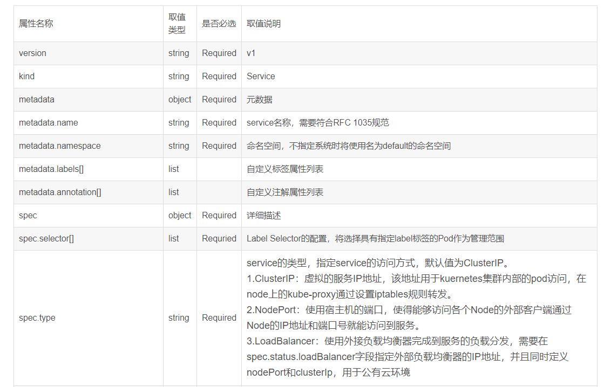
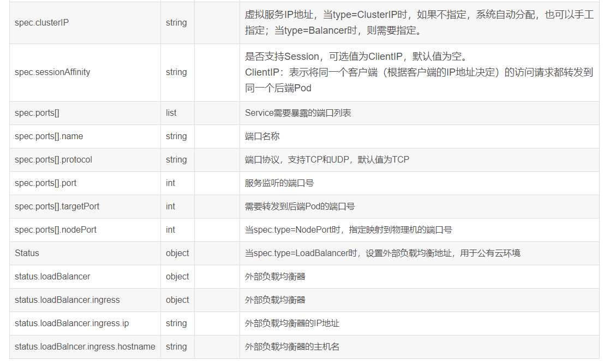

```yaml
apiVersion: v1
kind: Service
matadata:                                #元数据
  name: string                           #service的名称
  namespace: string                      #命名空间  
  labels:                                #自定义标签属性列表
    - name: string
  annotations:                           #自定义注解属性列表  
    - name: string
spec:                                    #详细描述
  selector: []                           #label selector配置，将选择具有label标签的Pod作为管理 
                                         #范围
  type: string                           #service的类型，指定service的访问方式，默认为 
                                         #clusterIp
  clusterIP: string                      #虚拟服务地址      
  sessionAffinity: string                #是否支持session
  ports:                                 #service需要暴露的端口列表
  - name: string                         #端口名称
    protocol: string                     #端口协议，支持TCP和UDP，默认TCP
    port: int                            #服务监听的端口号
    targetPort: int                      #需要转发到后端Pod的端口号
    nodePort: int                        #当type = NodePort时，指定映射到物理机的端口号
  status:                                #当spce.type=LoadBalancer时，设置外部负载均衡器的地址
    loadBalancer:                        #外部负载均衡器    
      ingress:                           #外部负载均衡器 
        ip: string                       #外部负载均衡器的Ip地址值
        hostname: string                 #外部负载均衡器的主机名
```      
目前kubernetes提供了两种分发策略：RoundRobin和SessionAffinity
RoundRobin：轮询模式，即轮询将请求转发到后端的各个pod之上
SessionAffinity：基于客户端IP地址进行会话保持的模式，第一次客户端访问后端某个pod之上，之后的请求都转发到这个pod之上
默认是RoundRobin模式
在某些场景之中，开发人员希望自己控制负载均衡的策略，不使用service提供的默认负载，kubernetes通过Headless Service的概念来实现。

#### 练习
定义nginx伸缩组，并绑定node节点
```yaml
---
apiVersion: apps/v1
kind: Deployment
metadata:
  name: kube100-site
  labels:
    aaa: bbb
spec:
  selector:
    matchLabels:
     app: web
  replicas: 2
  template:
    metadata:
      labels:
        app: web
    spec: 
      containers:
        - name: front-end
          image: nginx
          ports:
            - containerPort: 80
      nodeSelector:
        disktype: ssd
```
解析
```yaml
---
apiVersion: apps/v1             #资源api接口
kind: Deployment                #资源类型
metadata:                       #资源元数据
  name: kube100-site            #资源名
  labels:                       #资源标签
    aaa: bbb                    #给这个资源打个标签
spec:
  selector:
    matchLabels:
     app: web                   #定义要匹配的标签，和下面的pod要一样来保证对pod的正常监控
  replicas: 2                   #定义保持pod的数量
  template:                     #模板（从这以下全是pod的配置）
    metadata:
      labels:                   #标签相关
        app: web                #便签信息
    spec: 
      containers:
        - name: front-end       #容器名
          image: nginx          #容器的镜像
          ports:                #端口定义
            - containerPort: 80
      nodeSelector:             ##定义到标签的node上，首先保证节点上存在的标签，没有则定义
        disktype: ssd
```


## 补充
### 运行谷歌chrome浏览器访问dashboard
```shell script
#!/bin/bash

mkdir key && cd key
#生成证书
openssl genrsa -out dashboard.key 2048 
# 192.168.56.102为主节点ip
openssl req -new -out dashboard.csr -key dashboard.key -subj '/CN=192.168.56.102'
openssl x509 -req -in dashboard.csr -signkey dashboard.key -out dashboard.crt 
#删除原有的证书secret
kubectl delete secret kubernetes-dashboard-certs -n kube-system
#创建新的证书secret
kubectl create secret generic kubernetes-dashboard-certs --from-file=dashboard.key --from-file=dashboard.crt -n kube-system
#查看pod
kubectl get pod -n kube-system
#重启pod，为pod的名称
kubectl delete pod kubernetes-dashboard-79ddd5-96wj9 -n kube-system
```

### docker访问指定仓库
说明：docker访问指定仓库的操作，是登录该仓库，如；
```shell script
$ sudo docker login --username=黄瓜二两1 registry.cn-hangzhou.aliyuncs.com
```
仓库：`registry.cn-hangzhou.aliyuncs.com/neo1303582949/test:v0.1`

### yaml配置文件中具体是什么结构
```yaml
apiVersion: 1
spec:
  - container: 
    - name: chao
      age: 15
    - name: neo
      age: 10
```
对应
```json
{
  "apiVersion": 1,
  "spec": [
    {
      "container": [
        {
          "name": "chao",
          "age": 15
        },
        {
          "name": "neo",
          "age": 10
        }
      ]
    }
  ]
}
```


### 辨析：nodePort、port、targetPort、containerPort

依次为NPTC，简记：牛排套餐

#### 1. nodePort
nodePort提供了集群外部客户端访问service的一种方式，:nodePort提供了集群外部客户端访问service的端口，
即nodeIP:nodePort提供了外部流量访问k8s集群中service的入口。

比如外部用户要访问k8s集群中的一个Web应用，那么我们可以配置对应service的type=NodePort，
nodePort=30001。其他用户就可以通过浏览器http://node:30001访问到该web服务。

而数据库等服务可能不需要被外界访问，只需被内部服务访问即可，那么我们就不必设置service的NodePort。


#### 2. port
port是暴露在cluster ip上的端口，:port提供了集群内部客户端访问service的入口，即clusterIP:port。

mysql容器暴露了3306端口（参考DockerFile），集群内其他容器通过33306端口访问mysql服务，但是外部流量不能访问mysql服务，因为mysql服务没有配置NodePort。对应的service.yaml如下：
```yaml
apiVersion: v1
kind: Service
metadata:
  name: mysql-service
spec:
  ports:
  - port: 33306
    targetPort: 3306
  selector:
    name: mysql-pod
```


#### 3. targetPort
targetPort是pod上暴露出来的的端口，从port/nodePort上来的数据，
经过kube-proxy流入到后端pod的targetPort上，最后进入容器。

与制作容器时暴露的端口一致（使用DockerFile中的EXPOSE），例如官方的nginx（参考DockerFile）暴露80端口。
对应的service.yaml如下：
```yaml
apiVersion: v1
kind: Service
metadata:
  name: nginx-service
spec:
  type: NodePort            // 配置NodePort，外部流量可访问k8s中的服务
  ports:
  - port: 30080             // 服务访问端口
    targetPort: 80          // pod控制器中定义的端口
    nodePort: 30001         // NodePort
  selector:
    name: nginx-pod
```

#### 4. containerPort
containerPort是规定在pod控制器中定义的、pod中的容器需要暴露的端口。targetPort映射到containerPort

例如，mysql 服务需要暴露 3306 端口，redis 暴露 6379 端口
```yaml
apiVersion: v1
kind: ReplicationController
metadata:
  name: redis-master
  labels: 
    name: redis-master
spec:
  replicas: 1
  selector:
    name: redis-master
  template:
    metadata:
      labels:
        name: redis-master
    spec:
      containers:
      - name: master
        image: kubeguide/redis-master
        ports:
        - containerPort: 6379	# 此处定义暴露的端口
```


#### 5. 总结
总的来说，port和nodePort都是service的端口，前者暴露给k8s集群内部服务访问，
后者暴露给k8s集群外部流量访问。从这两个端口到来的数据都需要经过反向代理kube-proxy，
流入后端pod的targetPort上，最后到达pod内容器的containerPort。


## rancher

### 全部节点
```shell script
# 关闭SElinux
setenforce 0 && sed -i "s/SELINUX=enforcing/SELINUX=disabled/g" /etc/selinux/config
# 关闭Swap：
swapoff -a && sed -i "s/\/dev\/mapper\/centos-swap/\#\/dev\/mapper\/centos-swap/g" /etc/fstab

yum install firewalld
systemctl start firewalld
systemctl enable firewalld

firewall-cmd --permanent --add-port=22/tcp
firewall-cmd --permanent --add-port=80/tcp
firewall-cmd --permanent --add-port=443/tcp
firewall-cmd --permanent --add-port=2376/tcp
firewall-cmd --permanent --add-port=2379/tcp
firewall-cmd --permanent --add-port=2380/tcp
firewall-cmd --permanent --add-port=6443/tcp
firewall-cmd --permanent --add-port=8472/udp
firewall-cmd --permanent --add-port=9099/tcp
firewall-cmd --permanent --add-port=10250/tcp
firewall-cmd --permanent --add-port=10254/tcp
firewall-cmd --permanent --add-port=30000-32767/tcp
firewall-cmd --permanent --add-port=30000-32767/udp
```
参考：<https://docs.rancher.cn/docs/rancher2/installation/options/firewall/_index/>

### master节点安装
```shell script
firewall-cmd --zone=public --add-port=80/tcp --permanent
firewall-cmd --zone=public --add-port=443/tcp --permanent
docker run -itd -p 80:80 -p 443:443 --privileged \
    --restart=unless-stopped \
    -e CATTLE_AGENT_IMAGE="registry.cn-hangzhou.aliyuncs.com/rancher/rancher-agent:v2.4.2" \
    registry.cn-hangzhou.aliyuncs.com/rancher/rancher:v2.4.2
```
ps：CATTLE_AGENT_IMAGE: 指定 rancher-agent 的镜像名称
ps2：从 UI 导航到Settings，然后编辑system-default-registry，Value 设置为`registry.cn-hangzhou.aliyuncs.com`

### work节点安装
```shell script
sudo docker run -d --privileged --restart=unless-stopped --net=host \
     -v /etc/kubernetes:/etc/kubernetes \
     -v /var/run:/var/run registry.cn-hangzhou.aliyuncs.com/rancher/rancher-agent:v2.4.2 \
     --server https://192.168.56.102 --token 5d9bvv7lzwqrzrddxjq5b74xd55rvcl869ns8x6nhvjrcwtq626vtj \
     --ca-checksum 095ba7fdd043e56f6e6221f25f8eaa3755eae539b77bbc3f70c099c97e0b0db3 --worker
```
ps：此命令是复制的rancher自动生成的命令，其中的ip地址和token都需要更改的哦

### 安装注意事项
- rancher安装节点不能和k8s主节点相同，不然ingress的端口会和rancher的端口80冲突
- 网络驱动采用calico，不然服务可能起不来

## 实战
### 准备工作
1、安装rancher
说明：这里依然采用了rancher哦

2、在rancher中建立集群

3、在集群master节点（注意：这里不是指rancher安装节点哦，而是k8s集群的主节点）安装kubectl（ps：）
- 下载kubectl；<http://mirror.cnrancher.com/>
- 安装Kubectl；<https://kubernetes.io/docs/tasks/tools/install-kubectl/>
说明：kubectl的操作会被rancher承认；即可以用`kubectl create -f xx.yaml`来创建集群，rancher可以看到


### php-fpm的yaml配置文件
```yaml
apiVersion: apps/v1
kind: Deployment
metadata:
  name: php-server
  labels:
    name: php-server
spec:
  replicas: 1
  selector:
    matchLabels:
      app: php-server
  template:
    metadata:
      labels:
        app: php-server
    spec:
      containers:
      - name: php-server
        image: registry.cn-hangzhou.aliyuncs.com/neo1303582949/prod-php:v0.2
        volumeMounts:
        - mountPath: /var/www/html/
          name: nginx-data
        ports:
        - containerPort: 9000
      volumes:
      - name: nginx-data
        hostPath:
          path: /root/k8s/nmp/html
---
apiVersion: v1
kind: Service
metadata:
  name: php
spec:
  ports:
  - name: php
    port: 9000
    protocol: TCP
    targetPort: 9000
  selector:
    app: php-server
```

### nginx的yaml文件
```yaml
# cat nginx-deploy.yaml
apiVersion: apps/v1
kind: Deployment
metadata:
  name: nginx-php
spec:
  selector:
    matchLabels:
      app: nginx-php
  replicas: 1
  template:
    metadata:
      labels:
        app: nginx-php
    spec:
      containers:
      - name: nginx-php
        image: registry.cn-hangzhou.aliyuncs.com/neo1303582949/prod-nginx:v1.0
        ports:
        - containerPort: 80
        volumeMounts:
        - name: nginx-data
          mountPath: /usr/share/nginx/html
        - name: nginx-conf
          mountPath: /etc/nginx/conf.d/
        # ubuntu这样的系统级docker容器中，容器内pid为1的程序，执行后退出了
        command: 
          - nginx
        args: 
          - '-g daemon off;'
          # 指定特定配置文件
          #- /xxx/nginx.conf
      volumes:
      - name: nginx-data
        hostPath:
          path: /root/k8s/nmp/html
      - name: nginx-conf
        hostPath:
          path: /root/k8s/nmp/conf
---   
apiVersion: v1
kind: Service
metadata:
  name: nginx-php
spec:
  type: NodePort
  ports:
  - name: nginx
    port: 80
    protocol: TCP
    targetPort: 80
    nodePort: 30003
  selector:
    app: nginx-php
```

### nginx的配置文件
```yaml
server {
    listen       80;
    server_name  localhost;   # 可以更改为具体域名，如果不用php获取域名，那么也可以不更改,ingress找得到相应pod
 
    #charset koi8-r;
    #access_log  /var/log/nginx/host.access.log  main;
 
    location / {
        root   /usr/share/nginx/html;
        index  index.html index.htm;
    }
 
    #error_page  404              /404.html;
 
    # redirect server error pages to the static page /50x.html
    #
    error_page   500 502 503 504  /50x.html;
    location = /50x.html {
        root   /usr/share/nginx/html;
    }
 
    # proxy the PHP scripts to Apache listening on 127.0.0.1:80
    #
    #location ~ \.php$ {
    #    proxy_pass   http://127.0.0.1;
    #}
 
    # pass the PHP scripts to FastCGI server listening on 127.0.0.1:9000
    #
    location ~ \.php$ {
    #    root           html;
        fastcgi_pass   php:9000;    # second：对应着php的svc
        fastcgi_index  index.php;
        fastcgi_param  SCRIPT_FILENAME  /var/www/html/$fastcgi_script_name;
        include        fastcgi_params;
    }
 
    # deny access to .htaccess files, if Apache's document root
    # concurs with nginx's one
    #
    #location ~ /\.ht {
    #    deny  all;
    #}
}
```

### 检验
```shell script
[root@node01 ~]# kubectl get svc
NAME                                       TYPE        CLUSTER-IP      EXTERNAL-IP   PORT(S)        AGE
ingress-8a133a1d495bc37af4bffb8179eb2a8c   ClusterIP   10.43.161.94    <none>        80/TCP         7h6m
kubernetes                                 ClusterIP   10.43.0.1       <none>        443/TCP        11h
myapp                                      ClusterIP   None            <none>        42/TCP         8h
nginx-php                                  NodePort    10.43.110.149   <none>        80:30003/TCP   14m
php                                        ClusterIP   10.43.132.161   <none>        9000/TCP       146m

[root@node01 ~]# curl 10.43.110.149
hello world!    # 当然前提是需要在/root/k8s/nmp/html创建index.html，内容为：hello world!
```
说明：当然也可以从浏览器访问节点的ip地址，如：`http://192.168.56.112:30003`

### 添加ingress
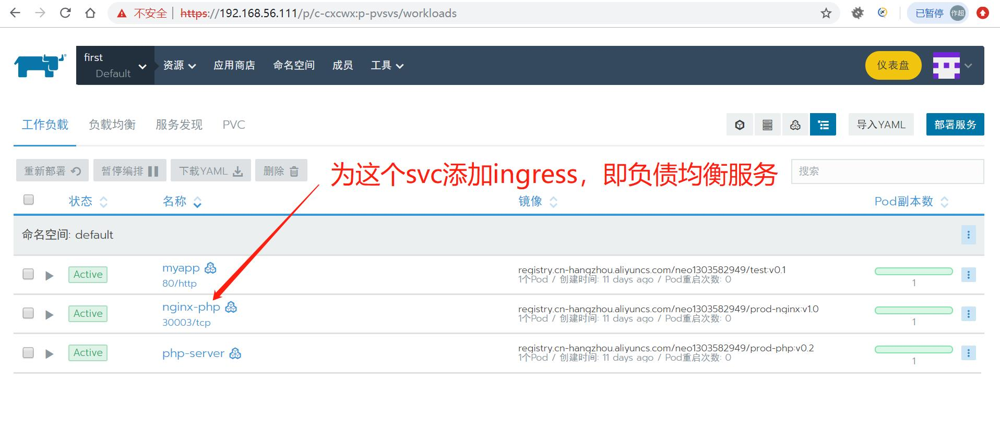
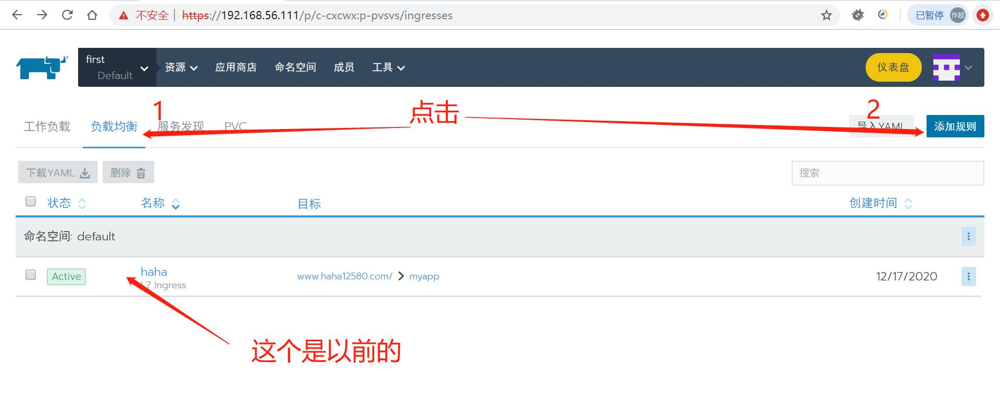
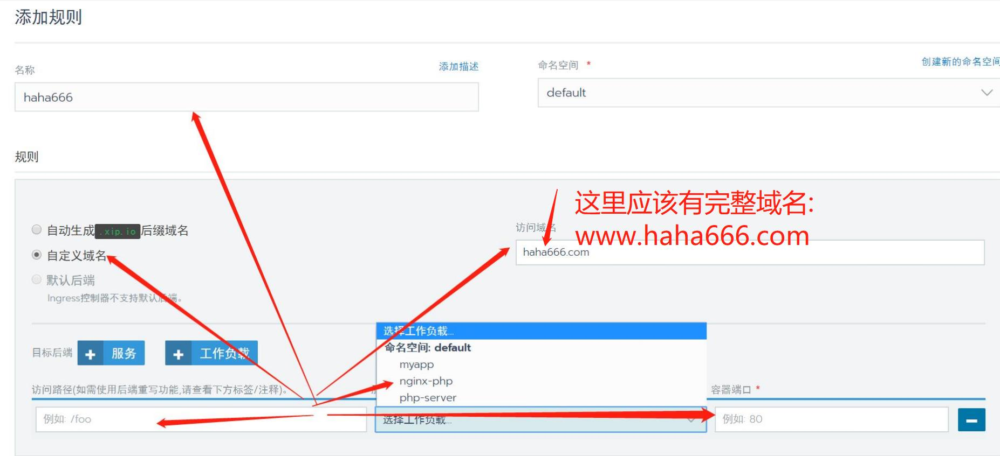
备注：更改本机文件hosts，访问地址即可（ps：如果无法访问，可以稍微等待一会儿）